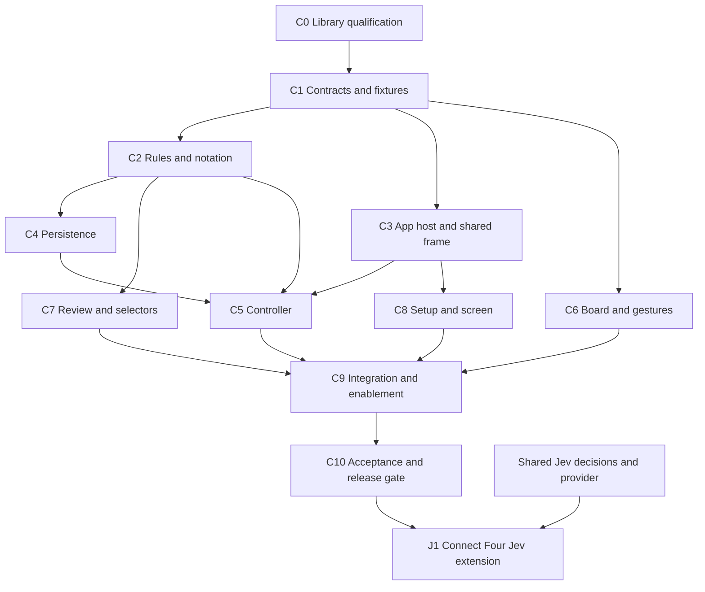

# Connect Four implementation plan

Status: Ready for engineering, with dependency qualification as the first implementation gate. Research and repository inspection: September 24, 2026.

This plan implements [connect-four-spec.md](connect-four-spec.md), including the applicable requirements in [product-spec.md](product-spec.md). The first deliverable is a complete, persistent RNG game. Jev support is a separately gated extension governed by [jev-spec.md](jev-spec.md); it does not block the RNG release. The user has identified the Connect Four specification as ready to build despite its draft header.

Requirement references below use **C** for Connect Four, **P** for the shared product specification, and **J** for Jev. For example, C4.1.2 is section 4.1, item 2. Proposed paths are implementation targets, not claims that those modules already exist.

## 1. Starting point and integration strategy

The repository already has React/TypeScript/Vite, Vitest, Playwright, an asynchronous RNG provider, request tokens/timers, a replay-validated local-storage implementation, and playable tic tac toe. Reuse these foundations.

However, the existing implementation is not yet a multi-game application:

| Existing area | Finding | Engineering action |
| --- | --- | --- |
| `src/App.tsx`, `src/main.tsx`, `src/app/AppProvider.tsx` | Bootstrap and context expose one tic tac toe controller. | Introduce an application host with persistent controllers for both games and a selected-game state. |
| `src/components/TicTacToeScreen.tsx` | Owns header, disabled tabs, settings, setup, status, and resignation dialog. | Extract the shared frame and controls; retain game-specific setup and board/history composition. |
| `src/app/registry.ts` | Registry rule type is tied to tic tac toe; Connect Four is disabled. | Use typed per-game registrations, with enablement in the final integration task. |
| `src/app/controller.ts`, `transitions.ts` | Lifecycle and effects are intertwined with tic tac toe types and legality checks. | Preserve tic tac toe transitions; reuse request primitives in a dedicated Connect Four controller. Avoid a wholesale generic controller rewrite. |
| `src/contracts/persistence.ts`, `src/storage/*` | One match key, one match envelope, tic tac toe decoding. | Parameterize match-key access and add a separate Connect Four decoder/replay path; retain old saves. |
| `src/contracts/game.ts`, `src/cpu/*` | Rules/provider interfaces and RNG sampling are already generic. | Reuse the interfaces, `sampleLegalMove`, request resources, and scheduler injection. |
| Tic tac toe board/selectors | Occupied cells directly inspect moves; activation uses clicks. | Do not copy this interaction into Connect Four: live occupied pieces target columns; inspection requires review. |

Keep game rules, CPU providers, and presentation separate. Use a small typed application host rather than building a general game framework. Shared extraction must preserve tic tac toe's behavior and tests. Chess stays disabled; no backend, router, canvas framework, drag library, or new state-management dependency is needed.

## 2. Engineering decisions and research

### D1. Required rules library behind an immutable adapter

Use `@devshareacademy/connect-four`, as required by C8.1. Its documented API exposes a mutable `ConnectFour` instance, column-based `makeMove`, a landing coordinate, a 42-cell numeric board, player identities, game-over/winner properties, and move history. The examples place the bottom row at array indices 35–41. These facts support a narrow adapter, not exposing library instances to React or persistence. [Upstream API and examples](https://github.com/devshareacademy/connect-four#api-documentation).

**Qualification gate:** the README does not establish that all simultaneous winning lines are returned, and its coordinate-return example is ambiguous about object versus array. Source/package artifact retrieval was unavailable during planning. No package version, declaration shape, complete-line behavior, or browser bundle compatibility is asserted as verified here. Task C0 must inspect the published artifact, record its exact version/license/exports/types, install it with an exact version and lockfile, and prove the assumptions below. Do not silently substitute another rules library if qualification fails.

**C0 artifact findings (implementation):** Published `@devshareacademy/connect-four@0.2.1` is pinned exactly in `package.json` and `package-lock.json`. Its package metadata declares MIT, CommonJS `main: dist/index.js`, TypeScript `types: dist/index.d.ts`, and no `exports` map. The root declarations export `ConnectFour`, `ConnectFourUtils`, and `ConnectFourData`. `ConnectFour.makeMove(col: number)` returns a `{row: number, col: number}` object; `board` is a copied 42-cell `(0 | 1 | 2)[]`, `playersTurn` is `ONE | TWO`, and `winningCells` is a coordinate array. A first move in column 0 returns `{row: 5, col: 0}` and fills board index 35 (A1). The artifact rejects filled columns and moves after terminal. Its range check erroneously accepts column 7, and it does not validate non-integer values, so the adapter's finite-integer 0–6 guard is mandatory. A legal simultaneous two-line final move reports only one four-cell line, confirming D2's board-derived complete-line requirement. A legal 42nd placement that wins is reported as a win rather than a draw. These behaviors are locked by `tests/unit/connect-four-library.test.ts`.

Adapter design:

- Keep internal player identities `one | two`; map them to colors using match setup. Rules do not depend on which color is human.
- Store a plain immutable `Position` containing a 42-cell board (`0 | 1 | 2`), the column sequence needed for replay, next player, board outcome, and winning lines. Copy arrays out of the library.
- Each `applyMove(position, column)` replays at most 42 columns into a fresh library instance, applies the legal move, and returns a new snapshot. Prefix reconstruction also uses a fresh instance. This avoids undocumented state injection, mutation leaks, and shared live/review engines. The bounded replay cost is preferable to a mutable engine cache in this release.
- Validate finite integer columns 0–6 before calling the library. Legal moves are non-full columns on an ongoing position. Match-level resignation separately prohibits all subsequent moves.
- Normalize coordinates to top-origin `{row: 0..5, col: 0..6}` and `cell = row * 7 + col`. Display column letters A–G and row `6 - row`; bottom-left is cell 35 / A1. Verify the conversion against the installed API.
- Determine next player from sequence parity, and return `null` from `sideToMove` for terminal positions; do not depend on what `playersTurn` reports after a win.

### D2. Complete winning-line presentation

**Scope update from implementation review:** showing one valid winning line is acceptable when a final move forms multiple lines. The contract permits one or more winning lines; downstream work need not derive every simultaneous line for presentation. The artifact behavior characterized in C0 remains recorded above. Other win detection, last-cell precedence, and terminal rules remain required.

Derive at least one valid presentation line from the resulting board and final landing cell. For each direction `(0,1)`, `(1,0)`, `(1,1)`, `(1,-1)`, walk both ways from that cell while the player matches. A maximal contiguous run of length at least four is a winning line. Stable cell and direction ordering is preferred when multiple lines are retained. A five-, six-, or seven-piece run includes all its cells when selected for presentation.

The library remains the move/rules engine. Adapter characterization must establish agreement between the library winner and a valid derived line, including a winning 42nd move. Normalize outcome in the order win, then full-board draw, then ongoing. If the artifact has a core win/draw defect, document and test a narrow adapter correction before proceeding; do not allow a disagreement to escape into the UI. Never create a line for resignation. Reconstruct lines from the displayed prefix, not the live board.

### D3. Concrete domain and view contracts

Add `src/contracts/connect-four.ts` and export it from the contract barrel. Freeze these shapes before parallel implementation:

| Type | Required contents |
| --- | --- |
| Setup | `humanColor: 'red' | 'yellow'`, `humanOrder: 'first' | 'second'`; derive CPU color, human player identity, and opening color. |
| Move | Column integer 0–6; landing cell is a result, never an independently trusted input. |
| Move record | One-based `ply`, column, landing cell, player identity, color, actor, provenance, optional allowed analysis/diagnostic. |
| Match | `gameId: 'connect-four'`, unique ID, setup, all move records, cached live position, match outcome. |
| Board outcome | Ongoing, win with player and all lines, or draw. |
| Match outcome | Board outcome or human resignation with winner and resignation ply; board remains unchanged on resignation. |
| View | Live or review with `selectedPly: number | null`; pending column; mobile panel and dialog state. `null` is only the empty-history review state. |
| Snapshot | Match/setup/view/request state plus shared settings and applicable notices. |

Commands: select color/order, start, restart, open/cancel/confirm resignation, rematch, select column, confirm move, toggle review, select piece/history, navigate previous/next, return current, retry CPU, set mobile panel, and start fresh. Settings and tab commands belong to the application host. Use discriminated unions for per-game commands; do not cast Connect Four to tic tac toe types.

Default setup is red and first. Rematch retains the previous setup choices but returns to setup and waits for Start. Restart with zero moves resets the same chosen setup under a new match ID; if CPU opens, issue a new request. Restart has no confirmation. Resign after at least one move always opens the shared dialog. Rematch after any terminal outcome needs no confirmation and replaces the old match. These choices preserve existing lifecycle conventions while meeting C3.3/C3.7 and P4.3.

History label: `ceil(ply / 2)` plus the move's color suffix, then landing coordinate. For example, a yellow opening followed by red is `1y A1`, `1r B1`. Player/color/actor must be derived consistently from setup and parity, not inferred from red always opening.

### D4. Application lifetime and shared settings

Create both controllers once outside React rendering. Start them once at app startup; this also recovers saved CPU turns for a game that is not currently visible. Dispose them only at application teardown/HMR. Switching tabs changes the visible screen and never cancels a CPU request or replaces a match. Use `useSyncExternalStore` for stable controller snapshots, following the existing repository pattern.

Move ownership of `confirmMoves` into one shared settings store using the existing settings key. Give both controllers the current setting and update notification; eliminate independent stale copies and duplicate settings writes. A setting change clears all pending selections and active gestures, without committing them. Tab switches clear active gestures/pending selections and close dialogs, but retain each game's historical selection and match. Refresh restores live mode. Selected tab persistence is not required; default to tic tac toe on reload.

Extract `AppShell` and reusable action/dialog/settings controls. Keep each game's setup, status derivation, board, and history adapters explicit. Change registry typing to describe metadata independently of rules, or use a keyed typed registration map; a union of incompatible rule function types must not become an unsafe dispatch mechanism.

### D5. Pointer input and confirmation state machine

Use DOM/CSS grid rendering and Pointer Events for mouse, touch, and pen. Pointer capture retains gesture events outside the board; hit-testing must use coordinates because the captured event target is not the release destination. The platform also supports cancellation and control of native pan/zoom through `touch-action`. [W3C Pointer Events, capture and direct manipulation](https://www.w3.org/TR/pointerevents3/#pointercapture).

Keep transient gesture state local to the board (`pointerId`, match ID, expected ply, preview column). Keep confirmation-mode pending column in the controller's transient view state. Neither is persisted.

| Event/state | Behavior |
| --- | --- |
| Live human turn, primary pointer down anywhere inside board | Begin one gesture, capture pointer, compute legal landing preview; an occupied piece is still a column target. A full starting column can yield no preview, then dragging to a legal column can select it. |
| Active pointer moves | Calculate column from the seven equal column bands of the board's content rectangle. Check both x and y bounds. Legal destination updates preview; full/outside hides the gesture preview. Ignore additional pointers and non-primary mouse buttons. |
| Pointer up, confirmation off | Recompute destination from release coordinates, verify original match/ply and current play eligibility, and submit one column command if legal. Clear gesture. No separate pointer-generated click handler may submit again. |
| Pointer up, confirmation on | Legal release sets/replaces pending column; it never commits. Invalid release cancels only the transient gesture and preserves any earlier valid pending selection. |
| Confirm move | Controller revalidates match, live mode, human turn, ongoing outcome, current setting, and legal pending column; apply exactly one move and clear pending state. |
| Cancel/lost capture, blur, unmount, layout change during drag | Clear transient gesture without submitting. A completed pointer-up must not be undone or submitted twice by subsequent lost-capture/click events. |
| Enter review, change setting, replace/end match, switch game | Clear pending and gesture state; hide Confirm move. |
| CPU turn, terminal match, review | Never run the play gesture path. In review, a normal occupied-cell activation selects its placement. |

Use `touch-action: none` and `user-select: none` on the playable board surface before a gesture starts; leave page scrolling available outside it. Do not disable browser zoom globally. Separate the coordinate labels from the hit-test rectangle. Clamp nothing outside the board into an edge column. Use the current rectangle on hit testing; cancel an ongoing gesture if resize/orientation change invalidates its geometry.

No available-column indicators, full-column message, or falling animation. A pending confirmation uses the existing 1.8-second tic tac toe fading pulse, with static opacity for reduced motion. The held preview does not blink. Reuse accessible native controls for settings, setup, history, confirmation, and review toggle; label the toggle and expose `aria-pressed`. Standard button activation remains supported; any non-pointer board activation path must route through the same guarded selection command without duplicating pointer submission. No bespoke keyboard navigation scheme is required.

### D6. Review and highlight semantics

Review is separate from “selected move,” because review can be enabled on an empty match. Toggle on selects latest ply when present, otherwise `null`; show an empty board and empty review UI in the latter case. If a CPU opening arrives while that empty review is open, keep the null selection/empty view until the user navigates or returns current. It is not a selectable initial-position history entry.

For selected ply N, replay moves 1 through N only. Build occupied-cell-to-ply mappings from that prefix; later pieces cannot be selected on the displayed board. History still lists the complete live sequence, allowing selection of later moves. Previous/next steps one ply, with bounds 1..live move count. From live, previous enters the latest move (matching current tic tac toe convention); next is disabled. From null review with newly arrived moves, next selects ply 1 and previous is disabled. Toggle off or Return to current restores the latest live position. CPU completions never rewrite view selection, even if the move ends the match.

Human inspection contains no CPU information and never jumps to a response. RNG inspection uses the existing random-move presentation. Pending responses have no history record or selectable piece. Live status above the board always describes the live match, including while reviewing; add a separate historical-position label to avoid confusing the two.

Preserve red/yellow piece fill. Use a blue outer ring for latest, purple outer ring for selected, and a separate green/red inner border or cell outline for human/CPU winning membership. This lets a final selected piece display both meanings. Text/accessible labels identify color, coordinate, selection, and winning state. Draw/resignation produce no winning overlay. Final winning overlays disappear when reviewing an earlier prefix.

### D7. Per-game persistence and recovery

Keep `pvjev:v0.5:match:tic-tac-toe` and `pvjev:v0.5:settings` unchanged. Add `pvjev:match:connect-four` with its own version-1 envelope. Version the Connect Four schema independently; an application release number is not a schema version. Parameterize only the storage adapter's match access (key + decoder); leave existing tic tac toe envelope semantics compatible.

Persist setup, ID, move sequence, cached live position, terminal outcome, and invalid-attempt recovery count 0–2. On every accepted human/CPU move, save before launching the next request. Persist resignation and remove only the affected match key when returning to setup. Keep settings separate. Request IDs, timers, errors, selected history, gestures, previews, and panels are transient.

Decoder order: validate envelope/version and bounded shapes (maximum 42 moves); validate setup; replay every column while checking legality and no moves after terminal; compare derived ply/player/color/actor/landing cell with each record; validate provenance and analysis; compare cached position, outcome, and all winning lines with replay. Resignation must occur at the recorded final ply on an otherwise ongoing board. Reject inconsistent or unsupported saves rather than trusting their cached boards. Normalize line ordering before comparison.

Start restored matches in live mode with no preview. An ongoing CPU turn starts one fresh attempt; terminal matches start none. A bad Connect Four save must not prevent tic tac toe loading. Existing in-memory fallback/notices and explicit Start fresh behavior remain the implementation default for unavailable/corrupt storage. P7.6/P11.3 still label that resilience policy proposed: track its product confirmation at release, rather than treating this plan as approval of a spec change.

### D8. CPU flow and Jev boundary

Use the existing asynchronous RNG provider, sampling uniformly from legal columns. Inject randomness, clock, IDs, and deferred test providers. Each response/timer is checked against game ID, match ID, expected individual ply, latest attempt ID, current CPU turn, and ongoing outcome before interpreting or applying it. Revalidate the returned column against the current board. Cancellation is an optimization; token checks are authoritative.

Retain the shared semantics: manual Retry becomes available at 5 seconds without automatically timing out; explicit errors offer Retry immediately; retry supersedes the previous attempt; each illegal response increments the counter and retries until attempt three produces a legal RNG fallback plus an error/diagnostic. Manual retries and service failures preserve rather than increment that counter; a valid move resets it. New matches reset it. Check stale responses before classifying them as invalid. A response during review or while another game is visible updates/saves only its own live match.

For the RNG milestone, human/RNG/fallback records contain no analysis. Reserve a separate `jev` provenance variant for the Jev extension; do not reuse the current tic tac toe type's optional analysis on `rng`. The RNG decoder must not silently accept unsupported Jev data.

The Jev extension must pass the pre-move board, setup/player mapping, and every legal column to the shared Jev provider, retain at most `min(10, legalCount)` ranked choices (Connect Four has at most seven), attach validated scores only to the accepted Jev move, and show them beside the post-move board. Analysis selection is a pure saved-data read. Preserve exactly `Rejected illegal move attempted by Jev, fell back to random move` for illegal-move fallback; fallback has no analysis. Schema migration/decoding, finite scores, unique legal choices, ranking, selected choice, and configuration metadata must follow the eventual shared Jev contract. Score meaning, ties, precision, API/model configuration, credentials, global $5 cap, timeouts, and SDK retry behavior remain the explicit J integration decisions, not guesses in this game plan.

## 3. Ordered work packages and dependency DAG

Dependencies below are completion prerequisites for merging a package. Work may start against frozen contracts/fixtures where noted, but integration cannot bypass a predecessor's gate. Each package includes its own meaningful tests; C10 is cross-system acceptance, not the first testing phase.

| ID | Work and owned paths | Depends on | Completion evidence |
| --- | --- | --- | --- |
| C0 | Qualify published rules dependency; update `package.json`/lockfile; add `tests/unit/connect-four-library.test.ts`. Record exact artifact findings in this plan. | None | Imports/types build with current Vite/TypeScript; A1 landing and board orientation verified; full/invalid column and terminal behavior characterized; multi-line and full-board-win cases checked; license recorded. |
| C1 | Freeze Connect Four domain, commands, view, storage envelopes, application-host/settings interfaces, and independent literal fixtures in `src/contracts/*`, `tests/fixtures/connect-four.ts`. | C0 | Contracts express all four setups, empty review, separate live/history state, and distinct provenance; existing consumers compile. |
| C2 | Implement immutable adapter, valid winning-line derivation, legality, notation, and prefix replay in `src/games/connect-four/{rules,notation}.ts`. | C1 | Rules suite covers both identities, four directions, intersecting wins, long runs, draw/win precedence, and input immutability. |
| C3 | Extract app host/shared settings and frame; revise registry types and tic tac toe integration in `src/app/*`, `AppProvider.tsx`, shared components. Keep Connect Four disabled. | C1 | Tic tac toe regressions pass; fake second controller survives navigation; one shared setting update reaches both without duplicate writes. |
| C4 | Add key-parameterized storage and `src/storage/connect-four.ts` decoder/replay. Own persistence adapter edits. | C2 | Literal valid/corrupt saves tested; old tic tac toe/settings keys remain compatible; independent match removal and CPU recovery metadata verified. |
| C5 | Build pure Connect Four transitions and effect controller in `src/app/connect-four-{transitions,controller}.ts`. Reuse `src/cpu/*` helpers. | C2, C3, C4 | Setup/actions, confirmation, review, save-before-request, retry/invalid/fallback, replacement/disposal, and all stale-response races pass with fake clock/deferred providers. |
| C6 | Implement board rendering and gesture helper/hook in `src/components/ConnectFourBoard.tsx`, `src/games/connect-four/input.ts`, scoped CSS. | C1 | Coordinate hit tests and cancellation tests pass; fixture-driven board proves drag/release and pending modes; no double submit or falling animation. Can proceed alongside C2/C3 using literal fixtures. |
| C7 | Implement selectors, history/review panel, and inspection in `src/games/connect-four/selectors.ts`, `src/components/ConnectFourHistory.tsx`. | C2 | Prefix selection, empty review, live updates under review, notation, highlight overlap, and provenance presentation pass selector tests. |
| C8 | Add two-row setup and game screen/status/actions in `src/components/ConnectFourScreen.tsx`, using shared frame and fixtures. | C3 | All setups and action labels render correctly; mobile panel, dialog focus, reduced motion, and shared setting controls work. |
| C9 | Wire real Connect Four controller/RNG/storage into `src/main.tsx`, `src/App.tsx`, provider/registry; enable tab. | C5, C6, C7, C8 | Playable complete RNG match; both controllers survive tab changes; refresh restores both; chess stays disabled. |
| C10 | Full acceptance, responsive/device checks, regression and production build. Add `tests/e2e/connect-four*.spec.ts` and extend existing multi-game tests. | C9 | Section 5 passes; traceability below has no uncovered RNG requirement; package qualification and resilience-policy status documented. |
| J1 | Connect Four Jev bridge, schema upgrade and saved-analysis presentation/tests. | C10, shared Jev integration decisions/provider | All C/J analysis and Jev fallback criteria pass; rollout explicitly enables the integrated provider. Not required for RNG release. |

Execution waves:

1. Finish C0, then C1. This prevents parallel work from choosing incompatible board coordinates or lifecycle contracts.
2. Run C2, C3, and C6 independently. C6 uses contract fixtures rather than importing unfinished selectors.
3. When C2 finishes, C4 and C7 can proceed in parallel; when C3 finishes, C8 can proceed. C6 may continue independently.
4. C5 starts after C2/C3/C4. Its pure transition tests may be drafted earlier, but its completion requires actual persistence and host integration.
5. Merge C9 only when C5–C8 are complete; then C10. Jev design work can progress separately at any time, but J1 ships only after its two gates.

The likely controlling chain is C0 → C1 → C2 → C4 → C5 → C9 → C10; C3 can also gate C5, and C6/C7/C8 can gate C9. This is dependency guidance, not an unsupported duration estimate. Keep `src/contracts/*` under C1 ownership, shared application edits under C3, and bootstrap/enablement under C9. Contract changes require coordinated updates to dependents before merging; avoid simultaneous edits to shared frame/storage files by separate workstreams.

## 4. Requirement-to-engineering traceability

| Requirements | Implementation tasks / decisions | Required verification |
| --- | --- | --- |
| C1; C2.1–2, C2.4; C10; P2–3 | C0/C3/C9/C10, J1 separately; retain browser-only SPA and scope exclusions. | Connect Four enabled only when functional, chess disabled, existing Pages base path/build intact; no extra features required. |
| C2.3; C3.1–4; C9.1–2 | C1/C2/C5/C8; D1/D3 | Four color/order combinations, CPU opposite color, either opener, gravity, alternating turns, two setup rows before each new match. |
| C3.5–6; C9.3–4 | C0/C2/C5; D2 | Both players/all directions, simultaneous lines, runs >4, draw, winning last cell, no post-terminal move including CPU response after resignation. |
| C3.7; P4.3 | C3/C5/C8; D3 | Restart/new ID at zero moves, confirmed resignation, rematch returns setup without confirmation; previous completed match replaced only then. |
| C4.1.1–5; C9.5 | C5/C6/C9; D5 | Press/drag/release, occupied starting cell, full/outside cancellation, legal release destination, one move, no indicators, no moves during CPU/review/terminal. |
| C4.2.1–5; C9.6; P4.3 | C3/C5/C6; D4/D5 | Default off/separate setting persistence, blinking pending piece, selection replacement, Confirm-only commit, revalidation, clear on review, no full-column pending move. |
| C5.1–5; C9.7 | C2/C7; D3/D6 | A1 and G6 mapping, both suffix orders, individual-ply navigation with no initial destination. |
| C6.1–5, C6.8; C9.8 | C5/C7/C8; D6 | Toggle including empty history, piece/history navigation, no later pieces, selected highlight, live restore, human and terminal-human inspection contain no CPU response. |
| C6.6–7; C9.9; P6; J1–4 | C7 for RNG; J1 for Jev; D8 | RNG identified/no scores, pending response absent from history; future saved Jev scores refer to pre-move choices beside post-move board; reopen makes zero requests. |
| C6.9; C9.11; P5.1 | C5/C7/C9; D4/D6/D8 | CPU arrival preserves selected ply/null review, saves live state, terminal review retained through reload until Rematch. |
| C7.1–5; C9.10 | C6/C7/C8/C10; D5/D6 | Exact live status meanings, blue/purple rings plus human-green/CPU-red win marks, overlap, historical visibility, reduced motion and no falling animation. |
| C8.1–3 | C0/C1/C2/C4/C5; D1–D3/D7 | Required library integration, complete-line supplement, persisted setup/sequence/live/outcome, prefix replay, boundaries and runtime validation. |
| C8.4; C9.12; P5/P7; J5–9 | C4/C5/C9/C10; D7/D8 | Complete RNG game/restore; save-before-CPU; 5-second Retry, errors, invalid count, legal fallback, stale tokens, hidden-tab continuation, reload recovery. |
| C8.5; P4.1/P3.2–3 | C3/C6/C8/C10; D5/D6 | Desktop side panel/visible board, mobile collapsible history, usable touch controls, real touch drag without page scrolling. |

## 5. Verification and release criteria

### Rules and storage tests

Add literal legal move-sequence fixtures for horizontal, vertical, both diagonal wins, intersecting final lines, over-four runs, a full-board draw, and a winning 42nd placement. Each fixture must be reachable without an earlier terminal move; assert that every proper prefix remains valid. Use independently specified expected boards/landing cells/lines so tests do not manufacture their expected results with the adapter under test. Run cases through both player-to-color mappings.

Test column boundaries, fractional/NaN/string inputs, full-column rejection, immutable input state, prefix reconstruction, and post-terminal rejection. Storage fixtures cover each setup, ongoing/CPU-turn/win/draw/resignation, malformed JSON, unsupported version, wrong actor/color/coordinate, impossible gravity, moves after win, mismatched cache/lines, invalid recovery counts, unsupported analysis, storage access/quota failures, and independent key removal. Existing tic tac toe saves/settings must still load unchanged.

### Controller and integration tests

Use fake clocks and controllable promises, not real waiting. Verify Retry is absent before 5 seconds and available at the threshold without a new automatic request. Resolve older attempts after retry, restart, resignation, rematch/new match, and disposal; none may mutate state. Exercise synchronous provider throws and asynchronous rejection. Interleave invalid responses, manual retry, and service failure to verify counter semantics and fallback provenance. Confirm a terminal human move makes no CPU request.

Record storage/provider calls to prove save-before-request ordering. Resolve CPU moves while reviewing both ordinary and terminal prefixes, during empty review, and while another game is selected. Verify settings synchronization, no duplicate request from React Strict Mode, and one recovery attempt per restored CPU turn. Changing tabs must not dispose requests. Repeated Confirm/double pointer events must not append a second move.

### Browser and visual checks

Use existing Playwright Chromium/Firefox/WebKit, iPhone 13, and Pixel 7 projects. Test actual mouse down/move/up sequences, release outside each edge, full columns, occupied-cell starts, pointer cancellation, capture loss, and compatibility clicks. Synthetic touch-pointer events can validate handler state but do not prove native scrolling/capture behavior: also manually verify press/drag/release on a modern iPhone/Safari and Android/Chrome, recording device/browser versions at release.

Check 1920×1080 and 2560×1440 desktop layouts and narrow mobile portrait/landscape. Start with the current 899px mobile-panel breakpoint, adjusting only if board/controls fail these checks. Use a responsive seven-column/six-row grid, touch controls targeting at least 44px, and no horizontal page overflow. Confirm board visibility beside desktop history, mobile expand/collapse access, focus return from resignation dialog, ordinary control activation, screen-reader labels, dark/light contrast, reduced-motion preview, and simultaneous selection/win marks.

Run `npm test`, `npm run build`, then `npm run test:e2e` against the production preview (the Playwright configuration serves the built app). Include existing tic tac toe suites; update assertions that previously required the Connect Four tab to remain disabled. Inspect the production route under `/pvjev/` and verify the library requires no Node-only globals or runtime CDN access. Do not claim passing tests until executed during implementation.

Release the RNG milestone only when C0–C10 are complete, every RNG traceability row has evidence, existing tic tac toe behavior/saves pass regression, and remaining product-policy issues are recorded. J1 is deferred until the shared Jev decisions are resolved; it must add provider/analysis persistence and end-to-end reopening/fallback tests before Jev enablement.

## 6. Bounded unresolved items

### C10 verification record (September 24, 2026)

- The production TypeScript/Vite build passed after the Connect Four responsive and review-label changes. The build emits the app under the configured `/pvjev/` base path; a local preview reported `http://127.0.0.1:4173/pvjev/`.
- The board uses a seven-by-six CSS grid with a `touch-action: none` play surface, coordinate labels outside the hit rectangle, a static held preview, and a 1.8-second pending pulse that becomes static under `prefers-reduced-motion: reduce`. The review toggle exposes `aria-pressed`; the historical-position label is visible above the board even when mobile history is collapsed.
- Edge-backed Playwright measurements against the production preview covered 375×812, 390×844, 393×851, 844×390, 899×844, 1920×1080, and 2560×1440. No horizontal document overflow occurred. The narrowest 375px board cell measured 44.42px; iPhone 13 and Pixel 7 widths measured 46.56px and 47px. The history panel is visible beside the board on desktop and collapsed with an accessible toggle below the board on mobile. Mobile and desktop screenshots were visually inspected; the board and controls fit without clipping. Keyboard Tab focus on a board cell showed a solid focus outline, and the pending preview had `animation-name: none` and 0.55 opacity with reduced motion enabled. The review toggle switched `aria-pressed` to true and showed an explicit empty-board historical label. These checks used installed Microsoft Edge as the Chromium executable because Playwright's bundled browser was absent. Chromium-computed contrast ratios for board status, coordinate labels, and history heading were 14.01:1 in both palettes; the review button was 9.52:1 in dark and 13.02:1 in light. Firefox/WebKit browser runs and real iPhone Safari/Android Chrome touch checks remain open; record device and browser versions before release.
- The existing storage resilience behavior remains the engineering implementation. Product confirmation of the proposed P7.6/P11.3 policy is still open and must be recorded before RNG release acceptance. No publishing has occurred.

| Item | Owner / resolving task | Effect |
| --- | --- | --- |
| Published dependency exact version, declaration/return shape, license and bundler behavior | C0 | Blocks adapter implementation until characterized; this is technical verification, not a new product choice. |
| Complete winning cells and last-cell outcome behavior of that artifact | C0/C2 | D2 supplies complete highlights; any rules discrepancy requires a tested adapter correction before release. |
| Shared storage resilience remains proposed in the PRD | Product owner / C10 | Continue engineering with existing repository behavior; record confirmation or required changes before final acceptance. |
| Jev API, score semantics, ranking/ties, credentials/global cap and network policies | Shared Jev work / J1 | Blocks Jev enablement only, not RNG Connect Four. |

All other choices needed for the RNG milestone are prescribed above. No dedicated keyboard scheme, archive, multiplayer, undo, difficulty, clocks, alternate board dimensions, historical branching, falling animation, or winning-line image assets are part of this plan.

