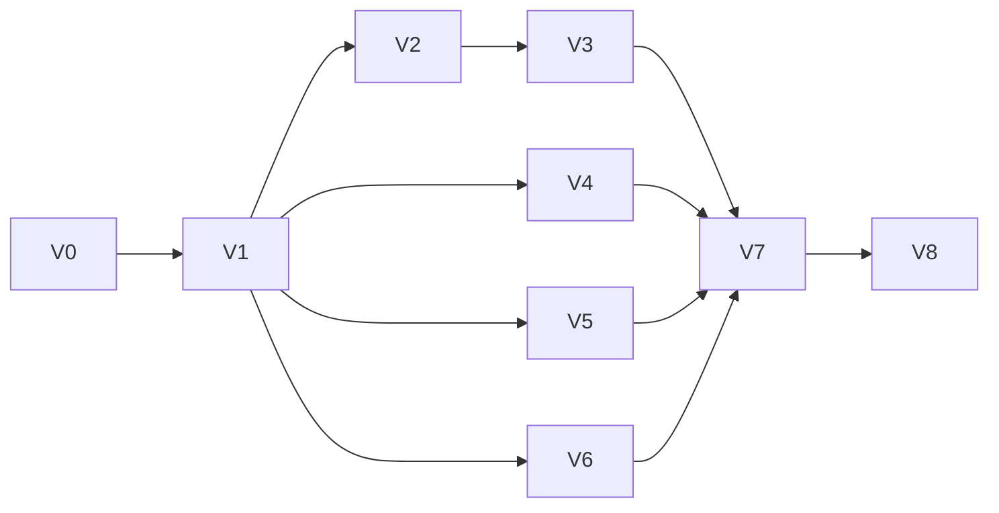
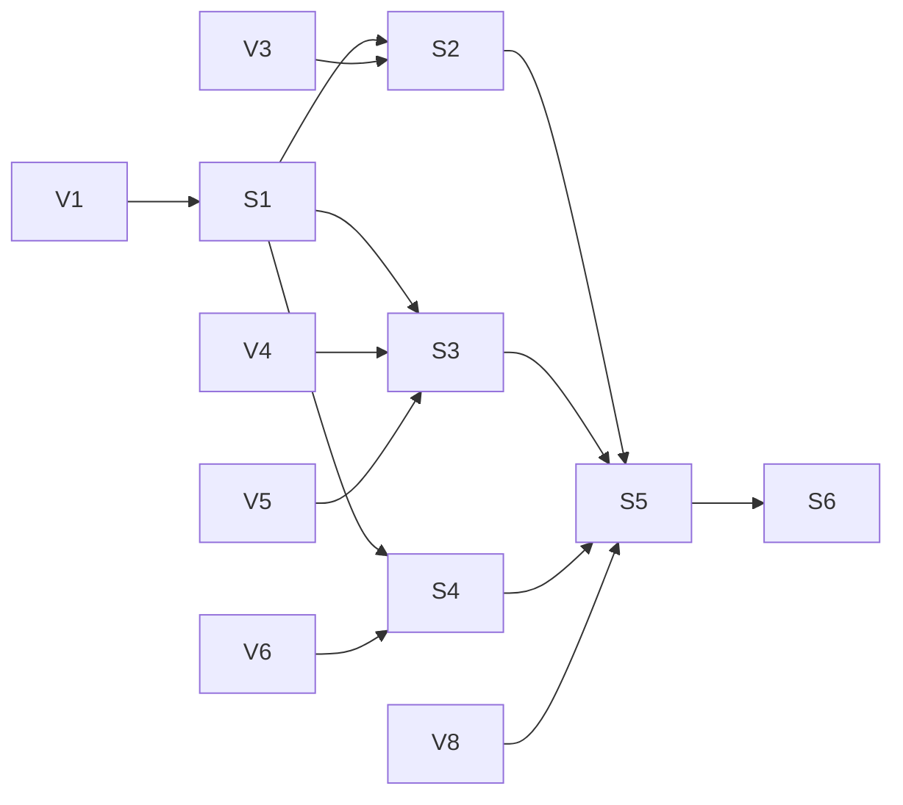

# Jev implementation plan

Status: Engineering plan; implementation and deployment verification are pending. This plan implements [jev-spec.md](jev-spec.md), which takes precedence over older shared Jev requirements. Section references below refer to that specification. Release scheduling remains in [product-spec.md](product-spec.md).

Ship visitor-key play first, then add shared-secret access without changing existing matches' routes. Chess, a global spending cap, model benchmarking, cross-tab synchronization, and server storage of full histories are outside scope. Each task includes tests; release gates also require deployed evidence.

## Part 1 — Implementation using only visitor key

### 1.1 Repository baseline and boundaries

Reuse the two controllers, deterministic rules, replay validation, request tokens, historical review, Supabase authentication, and aggregate statistics.

| Existing area | Engineering action |
| --- | --- |
| `src/contracts/game.ts`, `application.ts` | Add request identity and CPU-side context to CPU input; typed Jev results/errors, access waits, and service-failure counter. Widen `MatchCompletedEvent.opponent` from `rng`. |
| `src/contracts/tic-tac-toe.ts`, `connect-four.ts` | Add immutable opponent/credential assignment. Give both games explicit `jev` provenance with required analysis. Remove Tic Tac Toe's allowance for analysis on ordinary RNG records. |
| `src/cpu/requests.ts` | Add an actual Jev deadline; existing `scheduleRetryAfter` merely enables Retry. Preserve ordinary RNG threshold behavior separately. |
| Both controllers and transition modules under `src/app/` | Dispatch by assignment, coordinate access/recovery, commit analysis, and report the assigned opponent. Current completion paths hard-code RNG. |
| `src/storage/index.ts`, `replay.ts`, `connect-four.ts`, persistence contracts | Version saves; validate Jev records; retain both counters and recovery disposition; offer fresh start for incompatible saves. |
| `src/main.tsx`, application/account runtime | Inject an in-memory key store and provider factory into both controllers; preserve account-at-completion statistics. |
| Screens, histories, selectors, `PlayAreaHeader` | Opponent label, key management, recovery, confidence, saved analysis, and accessible tie caution. |
| `supabase/` | Add Edge Functions with separately pinned server dependencies. No allowance-table migration in Part 1. |

Extract a small shared Jev attempt/recovery helper consumed by both controllers. Keep move application and review transitions game-specific; a generic controller rewrite is not a prerequisite. Proposed modules: `src/contracts/jev.ts`, `src/cpu/jev.ts`, `src/app/jev-access.ts`, game-specific `jev.ts` serializers, and runtime-neutral `shared/jev/` protocol/validation helpers. Server SDK imports must not enter browser dependency paths.

### 1.2 Researched design decisions

Official documentation reviewed during preparation (2026-09-30/2026-10-01). These are selected designs, not claims that the code already implements them.

| Decision | Evidence and implication |
| --- | --- |
| Use `@typesafe-ai/sdk` only in Edge Functions | The [JavaScript SDK](https://docs.typesafe.ai/sdk/javascript) exposes `TypeSafeClient`, `choice`, and `systemOne`. Its quickstart targets Node 20+, so V0 must demonstrate Deno compatibility and pin the tested package version in function dependency configuration/lockfile. |
| One `move` Choice question, explicit `model: 'jev-latest'` | [Choice](https://docs.typesafe.ai/primitives/choice) returns choice, confidence, and a probability map. The [models reference](https://docs.typesafe.ai/models) distinguishes the requested alias from the resolved response model. Retain the latter; do not pin the model when pinning the SDK. |
| Set `retry: { maxRetries: 2, maxRetryAfterMs: 1500 }` | The [retry policy](https://docs.typesafe.ai/sdk/javascript/api/interfaces/RetryPolicy) counts retries after the first request: at most three upstream calls per product attempt, subject to cancellation. Leave other retry settings at defaults. |
| Enforce a total deadline outside SDK timeouts | [RequestOptions](https://docs.typesafe.ai/sdk/javascript/api/interfaces/RequestOptions) supports cancellation across calls and pending retries; its timeout is per HTTP attempt. That alone cannot enforce the browser's five-second round trip deadline. |
| Explicit credentials and disabled SDK logging | [Client configuration](https://docs.typesafe.ai/sdk/javascript/api/interfaces/TypeSafeClientConfig) supports environment-key fallback and debug body logging. Validate credentials before constructing a fresh client, pass the supplied key explicitly, use a no-op logger, and never serialize raw SDK exceptions. |
| Separate visitor/shared endpoints | [Supabase Edge authentication](https://supabase.com/docs/guides/functions/auth) supports public functions without gateway JWT verification and protected functions with verified user access. The guest handler must have no shared-secret lookup path. |

V0 is a bounded compatibility gate: confirm exact SDK request/result types, resolved-model availability, Deno imports, and cancellation during retry waits locally and in deployed Edge Functions. Record the actual pinned version and necessary adaptations in source/deployment notes. Do not silently replace prescribed SDK retries with an application retry loop if compatibility fails.

### 1.3 Match and credential contracts

Freeze this assignment before parallel work:

```ts
type OpponentAssignment =
  | { opponent: 'rng' }
  | { opponent: 'jev'; credentialRoute: 'visitor' }
  | { opponent: 'jev'; credentialRoute: 'shared'; approvingUserId: string;
      accessClass: 'daily' | 'whitelisted' };
```

Reserve the shared variant for Part 2; Part 1 never selects or serves it. At Start, a nonempty supplied key selects visitor Jev in either game regardless of sign-in; otherwise select RNG. No TypeSafe preflight: a rejected key follows service-failure rules on the CPU attempt. Adding a key cannot upgrade an existing RNG match. Fallback never changes assignment.

Own the key in a private in-memory application store. Public snapshots expose only `hasKey` and a revision. A masked input supports Save/Replace and Clear, uses `autocomplete="off"`, avoids form submission, and clears its draft on save/clear/unmount. Copy the key only into a transient request. Both games share this page-session store; disposal clears it and reload loses it.

Replacing/clearing a key invalidates pending visitor attempts using its old revision before abort, without advancing counters. Re-entry resumes a waiting restored turn; a previously failed turn still needs manual Retry. Never store keys in browser storage, cookies, URLs, databases, files, caches, analytics, crash reports, test traces/fixtures, or a shared SDK instance.

### 1.4 Relay and wire protocol

Version `POST /functions/v1/jev-visitor` JSON:

```ts
type EvaluationRequest = {
  protocolVersion: 1;
  gameId: 'tic-tac-toe' | 'connect-four';
  matchId: string;             // UUID
  expectedPly: number;         // existing turn identity
  attemptId: string;           // fresh UUID per product attempt
  state: SerializedGameState;
  legalMoveIds: string[];      // complete canonical list
  visitorKey: string;          // visitor endpoint only
};
```

One browser `fetch` uses an abort signal, `cache: 'no-store'`, and no automatic retry wrapper. Responses echo protocol/game/match/ply/attempt identity. Success includes Choice answer and resolved model ID; the browser validates against its captured legal list. The relay validates upstream data too and returns safe `invalid_response` envelopes for malformed successful answers, without raw bodies. Current games have at most nine/seven options, below the retention cap.

Typed errors: `authentication`, `authorization`, `rate_limit`, `transport`, `service`, `invalid_response`, with fixed safe messages. HTTP/network/relay failures count as service failures; malformed Choice data counts as invalid. Unusable relay envelopes count as service/protocol failures. Never expose arbitrary upstream exception text. Discard stale identities before changing counters.

Visitor handler responsibilities:

1. OPTIONS/POST only; exact development/deployed origin and header allowlists, `Vary: Origin`, CORS on errors too. CORS is browser access control, not account authorization.
2. `verify_jwt = false` for guests. Require a nonempty visitor key before SDK construction even if a server environment key exists. Account status is irrelevant here.
3. Enforce streamed 16 KiB body and 4 KiB key bounds, UUIDs, game/board dimensions/values, turn/CPU-side consistency, and ongoing state. Reject unknown fields, histories, arbitrary instructions/criteria/model overrides/URLs. The key bound is defensive, not a guessed key format.
4. Build prompts/criteria from trusted game helpers. Verify supplied legal IDs equal the server-derived full canonical list. Extract pure board legality/terminal helpers shared between runtimes and test parity with existing adapters. Never serialize Connect Four's `columns` history field.
5. Fresh SDK client with supplied key, fixed model/retries, no-op logger. Combine request cancellation where supported with a five-second server timer beginning at handler entry. Bound the handler wait even if abort is ignored; clean resources in `finally`. This later timer supplements the browser deadline, not guarantees it.
6. Normalize output and set `Cache-Control: no-store`. Logs may contain only allowlisted codes, request ID, game, duration, and status. Audit platform logging/error integrations; no body/header capture or raw exceptions.

### 1.5 Exact game inputs and prompts

Place serializers/criterion builders beside game integrations with source comments `Jev prompt v1` explaining coordinates/order. Share pure implementations with the relay. Prompt versions are not UI content.

| Game | State and criteria |
| --- | --- |
| Tic Tac Toe | `{ game: 'tic-tac-toe', board: threeRowsOfThreeCells, sideToMove, cpuSide, coordinates: 'Columns A-C left to right; rows 3-1 top to bottom; null is empty' }`. Values X/O/null. IDs `cell-0` through `cell-8`, ascending legal index order. Description: `Place {cpuSide} at {coordinate}.` Index 0 is A3, index 8 is C1. |
| Connect Four | `{ game: 'connect-four', board: sixRowsOfSevenCells, sideToMove, cpuSide, colors: { one, two }, coordinates: 'Columns A-G left to right; rows 6-1 top to bottom; 0 empty, 1 player one, 2 player two' }`. IDs `column-0` through `column-6`, ascending legal column order. Description: `Drop {cpuColor} (player {cpuSide}) in column {letter}; it lands at {coordinate}.` Derive landing coordinate from the board. |

Tic Tac Toe `instructions`:

> Choose the best legal move for cpuSide in this Tic Tac Toe position. Players alternate placing X or O in an empty cell. X moves first. Three matching symbols in a row, column, or diagonal win; a full board without a winner is a draw. Choose a move that wins if possible, otherwise prevents defeat and seeks the best achievable result against optimal opposition. Select only from the supplied criteria.

Connect Four `instructions`:

> Choose the best legal move for cpuSide in this Connect Four position. Players alternate dropping a piece in a non-full column; it falls to the lowest empty cell. Four matching pieces horizontally, vertically, or diagonally win; a full board without a winner is a draw. Choose a move that wins if possible, otherwise prevents defeat and seeks the best achievable result against optimal opposition. Select only from the supplied criteria.

Call `systemOne` with this state, `model: 'jev-latest'`, and exactly `questions: { move: choice(instructions, criteria) }`. No history, shortlist, per-move calls, random sampling, or confidence threshold.

### 1.6 Validation and retained analysis

1. Require the expected Choice answer, nonempty resolved model ID, and exactly one probability per supplied legal ID, with no extras. Reject missing/duplicate entries, numeric strings, NaN, Infinity, and confidence/probabilities outside `[0, 1]`.
2. Require `abs(sum(probabilities) - 1) <= 1e-6`. This absolute tolerance is an engineering constant tested at its boundaries. Do not round, normalize, or clamp before validation/ranking; change tolerance only with provider evidence.
3. The returned choice must identify a supplied ID with the greatest unrounded probability. A lower-scoring choice is invalid even when display values round alike.
4. Exact numeric ties resolve to the earliest move in supplied legal order, even if the provider chose another tied leader. No epsilon for tie membership.
5. Sort the complete distribution by descending unrounded probability then legal order; retain the first ten. The played move is necessarily included. Retain `{ confidence, choices: [{ moveId, probability }], tie: { count, selectedMoveId }, resolvedModelId }`. Tie count is at least one; caution appears above one. Do not retain raw responses or another distribution field.
6. Immediately before commitment, recheck deadline, live match/turn/attempt, ongoing CPU turn, and current legality. Rules resolve terminal/no-legal-move states without Jev or fallback sampling.

Confidence remains the provider's decision confidence, not the chosen move's probability. History starts with `Confidence 0.742` followed by normal notation; breakdown uses `Choice probability`. Format both to three decimals but save unrounded values. Explain these are choice probabilities, not win probabilities. Keep resolved model metadata internal.

A focusable/tappable caution says: `Several moves have the same highest choice probability. The first legal move in game order was chosen.` Use saved analysis only. Both games show the selected move's post-move board and pre-move analysis; human selection never selects the subsequent CPU response. Human/RNG/fallback moves have no scores. Fallback has its own label/diagnostic. Keep desktop boards visible and mobile analysis accessible in existing panels.

### 1.7 Attempt/recovery state machine

Persist `{ consecutiveServiceFailures, consecutiveInvalid }` independently of transient attempts. Save counter changes before offering Retry or issuing automatic invalid-response retries. Successful Jev moves and fallback atomically save the move and reset both counters. Saved counts are 0–2; the third failure resolves directly to fallback.

| Current event | State change | Next action |
| --- | --- | --- |
| Dispatch | Fresh attempt UUID, captured board/legal list, credential revision, dispatch time | One relay request; five-second deadline |
| Valid result before deadline | Reset both counters | Commit Jev move plus analysis |
| Service failure/expiry reaches 1 or 2 | Increment service count only | Error and manual Retry; auth/rate-limit toast once per product attempt |
| Third service failure | Recompute current legal moves | RNG fallback with `Jev service failed three times; fell back to random move`; reset both counters |
| Invalid answer reaches 1 or 2 | Increment invalid count only; do not reset service count | Fresh automatic attempt/deadline |
| Third invalid answer | Recompute legal moves | RNG fallback with exact diagnostic `Rejected illegal move attempted by Jev, fell back to random move`; reset both counters |
| Retry, resignation, Restart, replacement, disposal, credential revision change | Invalidate before abort; no counter increment | Fresh attempt for Retry, otherwise lifecycle/access transition |
| Stale/superseded/already-expired answer or rejection | No move, analysis, toast, or counter mutation | Ignore |
| Missing key | Waiting-for-key; no failure | Re-entry on the saved visitor route |

At five seconds, invalidate first, abort second, count one service failure. The later abort rejection cannot count again. Also compare elapsed monotonic time in response callbacks: delayed timers cannot authorize late answers. Inject a monotonic clock (`performance.now` in production). Background throttling may delay rendering expiry but must never permit its response to commit.

SDK retries stay inside one product attempt. Do not introduce service retries through effects, rerenders, game selection, or credential notifications. Manual Retry supersedes pending work where available. Switching games/history does not cancel valid requests; their live moves do not move historical selection. Fallback preserves Jev assignment; the next CPU turn tries the same route again.

### 1.8 Persistence, controls, and statistics

Version both match envelopes, preserving separately stored settings. Retain assignment, ID, moves/outcomes, provenance/diagnostics, analysis, counters, and recovery disposition (`ready` or `manual-retry-required`). This prevents reload from turning a saved service failure into an automatic retry loop. Restored interrupted pending/ready CPU turns get fresh attempts after key re-entry; restored failed turns retain manual Retry. Do not save old pending tokens, timers, controllers, or keys.

Replay moves to validate boards. Validate analysis against each pre-move legal list, ordering, selected move, tie metadata, numeric ranges, and provenance. A truncated top ten need not sum to one; apply sum validation when all legal choices are present (always true in these games). Keep full numeric precision. Corrupt/old saves take the explicit fresh-start path; no compatibility migration required. Storage failure permits warned in-memory play, without a promise of reload recovery. Offline history needs no key/network.

Key controls sit near account/setup controls and remain available to guests. Copy: `Use your TypeSafe API key` and `Kept only for this page session. Reloading clears it.` Waiting match: `Re-enter your TypeSafe key to continue this Jev match.` Show `Opponent: Jev`/`Opponent: RNG` from assignment, never the latest move; no opponent selector.

Completion events use assigned opponent, including resignation/fallback. Existing `record_game_result` SQL and statistics display support Jev columns; remove RNG hard-coding rather than create another table. Preserve existing result reconciliation/deduplication, account-at-completion semantics, and no retroactive guest credit. Part 1 retains ordinary Restart/Resign/Rematch behavior.

### 1.9 Ordered work and parallelism

Dependencies must land before integration; parallel tasks can use agreed fixtures after V1. Assign one owner for shared contract changes and sequence conflicting controller/storage edits.

| ID | Dependencies | Deliverable and completion evidence |
| --- | --- | --- |
| V0 | None | SDK/Deno probe, pinned version, deployment notes. Demonstrate Choice/model, retry count, retry-wait cancellation without retained credentials. |
| V1 | V0 | Freeze protocol, assignment/analysis/errors, prompts, recovery transitions, schema versions; contract tests reject invalid routes/provenance. |
| V2 | V1 | Pure game serializers/legal mapping and validator; fixtures for both sides/colors/orders, full columns, all legal moves, terminal states, ties, numeric boundaries. |
| V3 | V2 | Visitor function and browser provider; CORS/input/security tests, mocked upstream retry counts, no environment-key fallback. |
| V4 | V1 | Shared recovery helper and both controllers; fake-clock, stale-answer, separate-counter, fallback, historical-selection tests using provider fixtures. |
| V5 | V1 | Save/replay schemas, assignment/analysis, counters/disposition, incompatible-save notices; integrate with V4 after both land. |
| V6 | V1 | Key store/controls, opponent/history/analysis UI, accessible caution, completion statistics changes using fixtures. |
| V7 | V3, V4, V5, V6 | Runtime wiring and both-game end-to-end integration; remove placeholder analysis paths. |
| V8 | V7 | Visitor-only gate: existing tests/build, browser acceptance, deployed relay smoke, key audit, redacted evidence. |



After V1, V2–V3 (game/relay), V4 (coordination), V5 (persistence), and V6 (UI/statistics) are parallelizable. V7 is the integration barrier.

V8 acceptance coverage:

- Both games, CPU first/second, colors, guest/signed-in visitors; key missing/entered/cleared/corrected/replaced; adding a key during RNG play does not upgrade it.
- Invalid/missing/extra probabilities, ranges/sums/confidence, wrong choice, exact versus rounded-only ties, provider selecting another tied leader. Synthetic >10-choice fixtures prove truncation.
- Five-second boundary, delayed callbacks, abort-ignoring responses/rejections, timeout/failure races, Retry/resignation/Restart/replacement. No stale moves, analysis, or counter changes.
- Mixed invalid/service failures, one count/toast per SDK product attempt, fallback/reset, reload at counters 1/2, preserved manual Retry, storage failure, offline/mobile review.
- Jev statistics after fallback, visitor sign-in before completion, no retroactive guest result.
- Real deployed guest calls from deployed origin, preflight/error CORS, valid/invalid disposable keys, unsupported-game/proxy payload rejection. Audit saves, bundle, application/platform logs, error reporting, test artifacts. Disable HAR/trace/body capture on live credential tests. Mocks alone do not satisfy this gate.

## Part 2 — Implementation adding support for shared secret key

### 2.1 Access and endpoint design

Preserve Part 1 visitor behavior. Resolve new-match access in this order:

| Condition | Assignment |
| --- | --- |
| Visitor key supplied | Visitor Jev, regardless of account/whitelist/allowance |
| No key, guest | RNG |
| No key, verified whitelisted account | Shared Jev in either game, unlimited |
| No key, non-whitelisted account, Tic Tac Toe | RNG |
| No key, eligible non-whitelisted Connect Four start | Shared Jev, daily |
| Definitive daily denial | RNG |
| Unknown access/approval result | Pending setup; reconcile same proposed UUID |

Add `jev-shared` evaluation and `jev-access` status/start/retire endpoints. Verify sessions before authorization queries or shared-secret reads. Use `supabase.auth.getUser(bearerToken)` inside handlers with the existing Supabase JS dependency; never trust merely decoded claims or body user IDs. Verify gateway JWT configuration for the project's actual signing keys in staging. If gateway verification must be disabled for compatibility, handler verification remains mandatory. OPTIONS can be public; data operations cannot.

Configure `JEV_SHARED_API_KEY` as a server-only secret with no `VITE_` equivalent, following [Supabase secrets](https://supabase.com/docs/guides/functions/secrets). Read it only in the authorized shared evaluation branch. The visitor handler never references it even though project secrets can be available to multiple functions. Separate privileged database clients from browser/user-scoped clients.

Every shared move rechecks current whitelist membership, permitting either game, or requires Connect Four and the verified account's current approved match UUID. Neither client `accessClass` nor match UUID alone grants access. Cooldown expiry does not authorize an unapproved match.

Bind every shared match locally to its original verified account, including unlimited matches. Missing/wrong account pauses requests; no silent credential change. A dispatched request rejected by server auth is a service failure; locally known missing sign-in is a wait state. Gaining whitelist can permit continuation but does not refund timestamps or rewrite the original daily classification. Losing whitelist does not grant daily approval mid-match; continuation must pass current checks or fail normally.

Shared evaluation uses the Part 1 contract without `visitorKey`; reject credential fields. A key entered during a shared match is available for future matches only. Visitor calls stay visitor calls when their key fails, including with the shared secret configured.

### 2.2 SQL schema, privileges, and atomic approval

Add a migration; leave the existing statistics migration intact:

```sql
create table public.jev_user_access (
  user_id uuid primary key references auth.users(id) on delete cascade,
  approved_jev_match_id uuid null,
  last_jev_match_started timestamptz null,
  is_whitelisted boolean not null default false,
  check (approved_jev_match_id is null or last_jev_match_started is not null)
);
```

Create a hardened after-insert trigger on `auth.users` and idempotent backfill (`ON CONFLICT DO NOTHING`). Test signup, existing users, cascading deletion. Never derive whitelist status from editable user metadata. This follows the separate-table pattern in [Supabase user management](https://supabase.com/docs/guides/auth/managing-user-data).

Enable RLS; revoke direct table access from `PUBLIC`, `anon`, and `authenticated`. This design routes status reads through the verified endpoint too, returning only the caller's fields. Only trusted administration changes whitelist; no whitelist editor is required.

Implement transactional operations callable only by the trusted relay role. Explicitly revoke default `PUBLIC` function execution and anonymous/authenticated execution. Harden any `SECURITY DEFINER` functions with `search_path = ''` and qualified names. Relay identity comes from verified auth, never the body. Generate updated `src/supabase/database.types.ts`.

Start approval accepts verified user ID, game ID, and proposed UUID. Lock the extension row with `SELECT ... FOR UPDATE`, then:

1. Validate game/UUID and require the extension row (trusted code may repair a missing row).
2. If Connect Four's proposed UUID equals the current approved UUID, return that existing daily approval and original timestamp unchanged, even if whitelist status subsequently changed.
3. Otherwise if currently whitelisted, return unlimited access without modifying allowance columns.
4. Otherwise reject Tic Tac Toe. For Connect Four, capture `clock_timestamp()` after obtaining the lock; permit only if no previous start or `now >= last_jev_match_started + interval '24 hours'`.
5. On approval, atomically set UUID and server timestamp. On denial, change neither. Return a typed decision and server-derived `nextEligibleAt`.

The row lock prevents two competing UUIDs from consuming one daily window. Same-ID retries remain idempotent while currently approved. An eligible new start replaces the previous ID. Old approved matches can continue during cooldown until retirement/replacement; elapsed 24 hours alone does not revoke them.

Retirement conditionally clears only `approved_jev_match_id` for the verified account where the supplied UUID matches. Never clear/advance the timestamp. Return success for already-cleared/nonmatching IDs so stale retries cannot revoke newer approval. Previously authorized in-flight upstream work may finish after retirement; client invalidation prevents application and wasted usage is acceptable.

### 2.3 Start reconciliation, restore, and retirement

Add setup states `idle`, `resolving-access`, `approval-unknown`, `ready`, independent of CPU failure counters. Before requesting approval, generate one UUID and persist a key-free start intent with game/setup, original account ID, and proposed UUID. Disable duplicate Start. An unapproved daily board cannot become playable.

Success persists assignment before play. Definitive denial creates RNG using the proposed UUID. Timeout, 5xx, connection failure, or malformed/lost response is unknown: preserve the intent and retry/reconcile the same atomic Start and UUID. No replacement daily start while unresolved. A status read showing no approval cannot prove an in-flight Start will not commit. Restore waits for the original account and repeats that idempotent operation. Guard responses by setup generation and account identity. Setup errors do not increment CPU counters.

Established shared matches restore by read-only authorization of saved UUID/account; never call Start or consume allowance again. If retired/replaced, keep history and report authorization failure on attempted continuation through normal recovery, not reassignment. Completed histories restore without network.

On daily Restart, Resign, or normal completion:

1. Invalidate attempts and atomically save local ending plus pending retirement `{ userId, matchId }` before network delivery. Local terminal state must not wait for the network.
2. Retire for the original account. Failure/missing original session keeps this small local outbox entry until that account's next online/session opportunity; remove only on acknowledgement. Never use an unrelated account's session. No key or history in the outbox.
3. Confirmed daily Restart also saves a new RNG match with a new UUID, bypassing normal selection for that one match even if a key/new eligibility exists. Later normal Rematch/setup uses ordinary selection.

Retirement is independent of statistics delivery. Failure never refunds allowance or reopens a match. The start intent covers crashes after approval but before local assignment; outbox covers crashes after ending but before retirement. On storage failure warn and continue in memory without promising crash recovery. Unobserved abandonment may leave approval until retirement/replacement; it never refunds the timestamp.

### 2.4 Daily lifecycle UI and statistics

Preserve ordinary availability: Restart before moves, Resign during play, Rematch after completion. Derive daily confirmation behavior from saved `accessClass: 'daily'`, not current eligibility or latest-move provenance. Add Restart confirmation even before the first move.

- Restart: `Your daily Jev allowance has already been used. Restarting will end this match and start a new RNG match. Your allowance will not be restored.`
- Resign: `Your daily Jev allowance has already been used. Resigning records a loss and will not restore your allowance.`
- Cancelling leaves match, request, and approval intact. Opening the modal does not cancel or retire anything.
- Show eligibility using server timestamps; displayed countdowns never authorize Start.

Confirmed resignation records a Jev human loss; normal completion remains Jev after fallback. Restart preserves ordinary statistics semantics for discarding an unplayed board (no invented loss); its new match reports RNG when completed. Visitor statistics still use account-at-completion, independent of key ownership. Shared binding controls access, not a new key-owner statistics model.

### 2.5 Ordered tasks and parallelism

Part 2 database/design work can begin after V1 freezes assignment contracts. Integration/release requires V8, preserving the visitor-only milestone.

| ID | Dependencies | Deliverable and completion evidence |
| --- | --- | --- |
| S1 | V1 | Migration, trigger/backfill, restricted transactions, generated types, SQL privilege/concurrency tests. |
| S2 | S1, V3 | Verified access/shared endpoints, secret, status/start/retire API, per-move checks. Forbidden calls never invoke TypeSafe. |
| S3 | S1, V4, V5 | Access store, start-intent journal, async setup, original-account binding, restore checks, retirement outbox; use agreed S2 API fixtures. |
| S4 | S1, V6 | Eligibility/waiting UI, daily confirmations, lifecycle/statistics fixtures. |
| S5 | S2, S3, S4, V8 | Shared integration, selection matrix, crash/race/lifecycle tests; visitor regression with shared secret configured. |
| S6 | S5 | Complete gate: SQL/function tests, app tests/build, deployed authorization/allowance checks, operational runbook and evidence. |



After S1, S2 (endpoints), S3 (client coordination/persistence), and S4 (UI) are parallelizable. SQL security/concurrency testing belongs in S1, not postponed until integration.

### 2.6 Verification and rollout

Database coverage: existing/new/deleted users, default whitelist false, forbidden table access and privileged RPC execution, exact 24-hour boundary, concurrent same/different UUID starts, unchanged denial timestamps, replacement, continuation during cooldown, matching/nonmatching/idempotent retirement. Include lock waits proving timestamp capture after the lock.

Browser/integration coverage: the selection table, visitor override for whitelist accounts, invalid visitor keys never using shared secret, no RNG upgrade after sign-in/key entry, missing/wrong original account, lost Start response, reload before response, duplicate Start, account switch during setup, replaced approval, whitelist changes, restore without new allowance consumption.

Lifecycle coverage: confirmation cancel/confirm before first move and with pending abort-ignoring work, resignation/completion, fallback identity, offline/lost retirement and reconciliation, stale retirement after new approval, timestamp preservation, correct statistics. Apply Part 1 deadline/recovery tests to shared auth/authorization errors.

Run `npm test`, `npm run build`, and `npm run test:e2e`. Add targeted Deno/function and SQL commands to scripts/CI during implementation. App builds do not validate Edge runtime/database privileges. Do not report unexecuted checks as passed.

Deployment order:

1. Apply/verify migration, backfill, privileges, transactions in staging, then target environment. Prepare trusted whitelist and non-whitelist test accounts.
2. Configure server secret, exact origins, protected functions. Keep shared selection disabled until backend checks pass; visitor-only support remains usable.
3. From deployed origin, exercise guest visitor calls, authenticated shared calls, forbidden guest/wrong-account/game calls, first approval, additional-start denial, continuation, retirement. Repeat key audits with both credentials configured. Save environment/version/results and redacted evidence in a deployment-verification document.
4. Enable shared selection and run lifecycle smoke tests. A rollout flag may disable new shared assignment but must not rewrite saved shared matches; retain endpoints or surface explicit access/service state.

Live verification requires configured Supabase access and disposable TypeSafe credentials. Their absence blocks the release gate; mocks cannot substitute. No win-rate threshold or global spending-cap implementation is required.

### 2.7 Requirement traceability

| Jev requirements | Engineering actions | Gate |
| --- | --- | --- |
| §1 scope; §2.1–2.8 selection, priority, fixed route, fallback identity | V1/V4/V6 assignment; S2–S5 access matrix/binding | V8, S6 |
| §3.1.1–3.1.6 relay, ephemeral keys, secret, verified identity, scoped contract, origins | V0/V2/V3/V6 visitor path; S2 protected endpoints | Deployed V8/S6 security audits |
| §3.2.1–3.2.9 extension, privileges, atomic approval, consumption, idempotency, continuation, retirement, restore | S1 SQL; S2 endpoints; S3 intent/outbox/restore | SQL concurrency/privilege suite, live S6 |
| §4.1–4.4 actions, warnings, cancellation, forced RNG Restart, resignation/completion | V4 ordinary lifecycle; S3/S4/S5 daily lifecycle | V8/S6 modal/stale-answer tests |
| §4.5 statistics identity and guest rules | V4/V6 completion identity; S4/S5 lifecycle | V8/S6 result assertions |
| §5.1–5.7 model/Choice, full legal list, prompts, terminal guards, validation/ties/staleness | V0–V4 | V8 serializer/validator/deadline suite |
| §6.1–6.6 confidence/labels/precision/ties, top ten/model, history, fallback diagnostic | V1/V2/V5/V6 | V8 replay/responsive review |
| §7.1.1–7.1.7 attempts, SDK retries, total deadline, cancellation/supersession, review | V0/V3/V4 | V8/S6 clock/uncancellable-response tests |
| §7.2.1–7.2.5 service counter, toasts, manual Retry, fallback/reset | V3–V6; S3 wait/error distinction | V8/S6 mixed failure/reload suite |
| §7.3.1–7.3.4 separate invalid counter, auto retry, exact diagnostic, fresh legal RNG/reset | V2/V4/V5 | V8/S6 fallback suite |
| §8.1–8.5 local fields/counters, restored access, offline history, schema replacement, boundaries | V1/V5; S3 shared metadata/intent/outbox | V8/S6 save/restore/offline tests |
| §9.1–9.10 acceptance criteria | All tasks; shared portions land in Part 2 | V8 visitor subset; S6 complete matrix |
| §10 implementation choices/references | Contracts, prompts, tolerance, SQL, UI copy, deployment design above; V0 verifies runtime compatibility | V1 review and V8/S6 evidence |

Implementation is complete only when both gates have evidence and all mapped requirements are covered. This document is the plan, not evidence that those gates passed.
