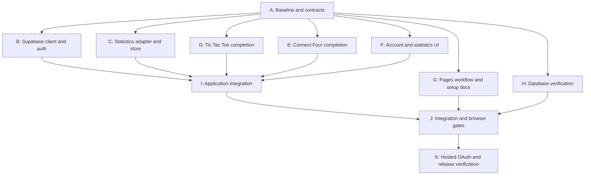

# v0.3 implementation plan

Status: Ready to guide implementation. Prepared: 2026-09-28.

This document prescribes engineering work; it does not claim that the feature, tests, or deployment are complete. Requirements come from [v0.3-technical-spec.md](v0.3-technical-spec.md), referenced below as **T**, and the existing [SQL migration](../supabase/migrations/20260928000200_game_stats.sql).

## 1. Scope and agreed boundaries

Deliver optional Google sign-in and personal win/loss/draw totals for Tic Tac Toe and Connect Four. Keep separate RNG and Jev totals, with Jev totals zero in this milestone. Current matches, moves, review history, and settings remain in browser storage. Supabase stores aggregate statistics and the two last-result metadata fields defined in the migration.

The user reports that Google/Supabase setup, SDK installation, local environment values, and execution of the migration are complete. Verify the resulting integration during implementation; do not rerun the creation migration against that database. There is no `saved_games` integration or transfer of existing local matches to Supabase.

Two edge cases are explicitly deferred by the user: account changes while a result request is in flight, and a match completing during initial session resolution. Do not add special handling, design decisions, or acceptance gates for those cases in this milestone. Ordinary startup session loading, sign-out cleanup, and clearing/ignoring obsolete statistics loads remain requirements. T4/T7 requirements about retrying under the same account are verified with an unchanged session; behavior across an in-flight account change is not certified by this release.

Jev access rules, Jev requests, Chess, match archives, public scores, realtime synchronization, and cross-tab match coordination remain outside scope. The accepted one-second database gate, last-ID-only duplicate protection, and browser-submitted results remain as specified. This plan does not reopen those decisions or change the product specification.

## 2. Repository baseline

- `@supabase/supabase-js` 2.117.2 is installed in this checkout. Preserve the package lock; no framework or SDK upgrade is needed for this work.
- `src/main.tsx` creates both controllers and the application host outside React rendering. `AppProvider.tsx` uses context and `useSyncExternalStore` for controller snapshots.
- Each controller has two completion paths: commands through `dispatch`, and CPU moves through `commitCpu`. Both persist the next match before publishing it. Completion integration must cover both paths in both games.
- Each game screen currently renders `AppShell`. Shared account services must outlive screen changes; screen mounting must not create clients or subscriptions.
- Current match IDs originate from `crypto.randomUUID()` in bootstrap. Retain those IDs when recording results.
- `vite.config.ts` sets `base: '/pvjev/'`. The Pages workflow builds pull requests and main with Node 24, and deploys main. Its build currently supplies no Supabase environment variables.
- Tests use Vitest for controllers and static rendering, and Playwright against a built preview on `/pvjev/`. Preserve those tools and existing fixtures.

Before implementation, run the existing unit suite and production build to establish the baseline, checking that the pinned design submodule is available. Record any pre-existing failures separately from v0.3 changes.

## 3. Engineering decisions

### D1. One typed client and narrow service boundaries

Create the browser client once in `src/supabase/client.ts`, called from application bootstrap. Inject that instance into the auth and statistics adapters. Use `createClient<Database>(url, publishableKey)` with typed database definitions in `src/supabase/database.types.ts`. Generate those definitions from the applied public schema using the installed Supabase CLI, then review them against the migration and commit them. Type generation is a developer operation, not a CI dependency on hosted database access. [Supabase type generation](https://supabase.com/docs/guides/api/rest/generating-types)

Add `src/supabase/config.ts` to read and validate `VITE_SUPABASE_URL` and `VITE_SUPABASE_PUBLISHABLE_KEY`, and declare their types in `src/vite-env.d.ts`. Missing or malformed configuration returns an unavailable account service rather than throwing during app import: RNG play must remain usable. Show a brief account-unavailable state and log the configuration problem without dumping credentials. Production publishing must separately fail its configuration check, as described in section 6.

Keep SDK types behind adapters. Define small application types and injected interfaces in `src/contracts/account.ts` and `src/contracts/statistics.ts`. Preserve SQL column names at the adapter boundary; map `rng_wins` to application `winRng`, `rng_losses` to `lossRng`, and so on. This also accommodates the product specification's application field naming without renaming the applied schema.

No additional state library, server, router, or Supabase SSR package is needed. Supabase Auth owns its persisted session; application code must never clear all browser storage on sign-out.

### D2. Browser OAuth with PKCE and a return to the existing app root

Configure auth explicitly with `flowType: 'pkce'`, `persistSession: true`, `autoRefreshToken: true`, and `detectSessionInUrl: true`. PKCE supports automatic code exchange in the browser when URL detection is enabled. Let the SDK perform that exchange; do not also call `exchangeCodeForSession` manually. This is a design choice for this static browser app, not a requirement to add a backend. [Supabase PKCE flow](https://supabase.com/docs/guides/auth/sessions/pkce-flow)

Use:

```ts
supabase.auth.signInWithOAuth({
  provider: 'google',
  options: {
    redirectTo: new URL(import.meta.env.BASE_URL, window.location.origin).href,
  },
})
```

Return to the deployed `/pvjev/` page, which GitHub Pages already serves. Do not introduce an `/auth/callback` route requiring a server rewrite. Register the exact local and deployed return URLs in Supabase; Google continues to use the Supabase callback URL. Restore selected game and match through existing local persistence. [Supabase redirect configuration](https://supabase.com/docs/guides/auth/redirect-urls)

Expose sign-in pending/error state, prevent repeated clicks during an active redirect attempt, and surface returned OAuth errors in the account control. After the SDK processes a return, remove consumed auth parameters if necessary without removing unrelated URL parameters or the base path. Never log callback codes, session objects, or tokens.

Use `signOut({ scope: 'local' })` so the action ends this browser session. The SDK's default is global sign-out; explicitly selecting local scope avoids unexpectedly signing out other devices. Clear displayed identity and statistics immediately when sign-out begins, settle to signed out on success, and resolve the actual session plus an inline error if sign-out fails. [Supabase sign-out scopes](https://supabase.com/docs/reference/javascript/auth-signout)

### D3. Auth and statistics stores outside the game snapshots

Implement `createAuthStore` in `src/app/auth.ts` with `start`, `dispose`, `subscribe`, `getSnapshot`, `signIn`, and `signOut`. Its snapshot distinguishes loading, signed out, signed in, and unavailable, plus pending action and safe display error. Only expose the user identity fields needed by the UI; retain SDK session details inside the adapter.

Register `onAuthStateChange` once and resolve the startup session with `getSession`. Reconcile both through one state updater, ensuring a late initial read cannot overwrite a newer auth event. Keep the event callback synchronous; schedule statistics work after it returns. Handle `INITIAL_SESSION`, `SIGNED_IN`, `SIGNED_OUT`, `TOKEN_REFRESHED`, and relevant user updates. Repeated events for the same user must not multiply subscriptions or reset totals. Unsubscribe on disposal. [Supabase auth events](https://supabase.com/docs/reference/javascript/auth-onauthstatechange)

Implement a separate statistics store in `src/app/statistics.ts`. Track idle/loading/ready/error states, rows by game, and result-failure notices. Load both game rows after sign-in. A successful query with no row means zero totals; a failed query means unavailable totals, not zero wins/losses. On a failed refresh, retain known totals for the same account and mark them unavailable for refresh. Supply a Retry action for a failed read; the result-write retry rule does not govern user-triggered reads.

Clear cached rows on ordinary sign-out or account change. Associate reads with a load generation and ignore superseded responses. Also prevent an older initial read from replacing a newer successful write response for the same game, using a per-game revision. These are ordinary stale-read controls, not an implementation of the deferred in-flight account-switch case.

Create the stores in `main.tsx`. Add an `AccountProvider` with `useSyncExternalStore` hooks, wrapping the existing `AppProvider`. Keep SDK creation, auth listeners, and result dispatch outside component render/effect lifecycles. Make start/dispose idempotent; dispose both stores and their subscriptions during the existing hot-reload cleanup.

### D4. Explicit completion events from both controllers

Add an optional `onMatchCompleted(event)` dependency to both controller dependency types in `src/contracts/application.ts`. The event contains `gameId`, the existing `matchId`, `opponent: 'rng'`, and human-perspective `result: 'win' | 'loss' | 'draw'`. Keep the callback optional so existing controller consumers and fixtures remain valid.

At the accepted transition, compare the previous and next match: same match ID, previous outcome ongoing, next outcome terminal. Capture the event before publishing can notify other application listeners. Attempt the existing local save first, publish the terminal snapshot, then invoke the callback once. Use the same helper from `dispatch` and `commitCpu`; do not put it inside general snapshot publishing, startup restore, React rendering, or history navigation. Isolate callback failures so they cannot interrupt local state or gameplay.

Map Tic Tac Toe wins against `humanSymbol`; map Connect Four wins against the player derived from the selected human order, not simply the token color. Draws map to draw; confirmed human resignation maps to loss. Supply RNG as the current milestone's opponent; future Jev integration must supply the match's starting opponent rather than infer it from move provenance.

The bootstrap callback synchronously captures the currently signed-in account and passes the immutable event to the statistics store. Signed-out completions make no request and are never replayed after sign-in. Add in-memory deduplication keyed by account/game/match for duplicate delivery during this app lifetime, including while a request is pending. Do not persist a replay queue or submit restored terminal matches.

### D5. A typed statistics adapter with one application-owned retry

Implement `src/supabase/statistics.ts` with three operations:

| Operation | SDK request | Result |
| --- | --- | --- |
| Load totals | Select the defined `game_stats` columns, filtered by current user ID | Rows for supported games; synthesize zeros only after a successful read |
| Record completion | POST RPC `record_game_result` with the four arguments in T6, followed by `.single()` | One updated row; validate and map it at this boundary |
| Reconcile uncertain write | Select the same user's row for the submitted game, using `maybeSingle()` | Confirm only if `last_match_id` matches the submitted match ID |

Do not send `user_id` or a completion timestamp to the RPC. RLS controls reads and the function obtains the writer identity from auth. Direct inserts, updates, and deletes are forbidden by the applied schema.

The installed SDK source, `node_modules/@supabase/postgrest-js/src/PostgrestBuilder.ts`, provides `.retry(false)`. Its default retries apply to idempotent reads, not the POST RPC. Explicitly disable SDK retries on all three operations so request budgets and reconciliation behavior are controlled here. Preserve SDK HTTP status and structured error codes in an adapter result; do not classify every `{ error }` as a network failure.

Use this result-write policy:

1. Send the RPC once. On success, validate/map its row and update only that game's displayed totals.
2. A structured database/PostgREST rejection is final on the first attempt. Log it, including the exact `Result already recorded or submitted too soon` text when returned. Do not retry or show a toast for that direct rejection.
3. A fetch failure with no HTTP response, a request timeout, or an unstructured gateway failure with status 502/503/504 is a transport failure. Retry once with identical arguments. Structured database errors take precedence over status-based classification. Authentication/permission failures, invalid inputs, and other HTTP errors do not qualify for automatic retry.
4. If that retry succeeds, use its row. If it returns the duplicate/too-soon rejection, perform one reconciliation read. A matching last ID confirms the saved result; use the returned totals.
5. If the retry fails otherwise, or reconciliation fails/returns no matching ID, log the failure and enqueue one toast: “Your result could not be saved.” Do not optimistically change totals.

Choose a 10-second timeout per statistics operation using an abort signal, with one retry after 250 ms for a transport failure. Treat these as engineering defaults and inject timing in tests. A timeout may occur after a committed write, so it follows the same reconciliation rules. Disposal cancellations must not trigger retries or toasts. A successful HTTP response with an invalid row is an adapter/schema error: log it and surface an unconfirmed-result toast without blindly repeating a potentially committed write.

Serialize completion writes within each account/game in memory, including a write's retry and reconciliation, so later results from this app cannot overtake that reconciliation. Different games can record independently. Do not introduce an artificial one-second wait to evade the database gate. All work remains asynchronous and never blocks Rematch, local saves, or review. No persistent offline queue is introduced; unconfirmed results are best effort as T4 specifies.

### D6. Shared account UI and personal totals

Add `AccountControls.tsx`, `PersonalStats.tsx`, and `ResultToast.tsx`, using the existing design tokens and responsive patterns. Pass a shared account view model from `App.tsx` through both game screens to `AppShell`; keep the props optional for existing standalone screen fixtures. Provider hooks stay in the application composition, not in the reusable screen fixtures.

Place account controls in the shared header alongside settings. Signed-out users see “Sign in with Google”; signed-in users see an account label and “Sign out”. While session state is loading, show a compact loading indicator in that area and preserve playable game controls. Pending or failed sign-in must not alter a match.

For a signed-in user, show a compact “Your stats” section for the selected game with Wins/Losses/Draws and separate RNG/Jev rows. Jev values remain zero and its unavailable status must not suggest that Jev play is enabled. Switching games selects the corresponding cached row without recreating services. Show a loading placeholder or a readable fetch-error state, not misleading zero totals.

Render result-failure notices through one polite live region with a dismiss button. Keep notices visible until dismissed, and deduplicate by completion so a retry cannot create two notices. Ensure keyboard access, accessible names, visible focus, mobile layout, and dark/light theme readability. Metadata such as last match ID stays out of the UI.

## 4. Work packages and dependency graph

An edge means the predecessor's interface or deliverable must be available before the dependent package is completed. Tests local to a package are part of that package, not postponed to the integration phase.



| ID | Engineering actions and principal files | Depends on | Done when |
| --- | --- | --- | --- |
| A | Establish baseline; define auth/statistics snapshots, adapter result types, completion event, timing dependencies, and optional controller callback. Generate/review `src/supabase/database.types.ts`; add shared contracts and test fakes. | None | Contracts compile and all branches can use stable interfaces and fakes. |
| B | Add `src/supabase/config.ts`, `client.ts`, auth adapter, `src/app/auth.ts`, and `src/vite-env.d.ts`; implement D1–D3 OAuth and lifecycle behavior. | A | Configured/unavailable startup, session restore, auth events, local sign-out, and OAuth errors pass focused tests. |
| C | Add statistics adapter/store, mappings, read states, request ordering, deduplication, timeout/retry/reconciliation, notices, and per-game read revision control. Use injected client/auth interfaces until integration. | A | D5 branches have deterministic tests proving write counts, arguments, unchanged totals on failure, and toast rules. |
| D | Wire completion callback into Tic Tac Toe `dispatch` and `commitCpu`; test symbols, terminal moves, draw, resignation, and excluded events. | A | One event after local persistence for every qualifying completion; none for restore/review/restart/rematch/invalid commands. |
| E | Apply the same integration to Connect Four, testing human first/second and both colors. | A | Equivalent completion guarantees hold independently of which game screen is visible. |
| F | Build account controls, stats panel, toast, and styles against view-model fixtures. Define optional shared-shell props and pass them through both screens. | A | Loading/guest/user/error/zero/populated states render correctly; keyboard and narrow-screen behavior are usable. |
| G | Update `.github/workflows/deploy.yml`, environment setup documentation, and a tracked placeholder `.env.example` with a `.gitignore` exception. Implement section 6. | A | Build-step variables, production checks, PR behavior, and documented redirect setup are concrete and reviewable. |
| H | Verify the applied schema and policies, obtain reviewed DB types, and create a reproducible database verification procedure or integration test harness. Coordinate type corrections with A's owner. | A | Section 7 database checks pass using disposable test users, or an external access blocker is explicitly recorded. |
| I | Compose client/stores/provider in `main.tsx`; bind both completion callbacks; connect `App.tsx` view model; add lifecycle cleanup. | B, C, D, E, F | A signed-in completion travels from either controller to adapter to displayed totals; guests and existing saves still work. |
| J | Execute automated acceptance mapping and workflow validation; verify the built artifact at `/pvjev/`. | I, G, H | Unit, build, browser, and database gates are recorded; no required failure is concealed by mocks. |
| K | Run real Google sign-in and deployed Pages checks; document configuration and verification results, then follow the project's release process. | J | Hosted acceptance checks pass and the release is ready; deployment is not implied by this planning document. |

Start A first. Then B/C/D/E/F/G/H can proceed in parallel against the agreed contracts. A single contributor can take B, D, E, C, F, G, H, I, J, K in order, using a real sign-in check as soon as B and enough of F/I are available. That early check does not require waiting for statistics writes.

To avoid editing conflicts, the A owner handles shared contract changes; D and E each own one controller; F owns screen/shell/styles; G owns the workflow and setup docs; I owns `main.tsx`, `App.tsx`, and provider composition. B/C expose factories without editing bootstrap. Any later contract change must be coordinated before dependent packages continue. The DAG describes parallelizable engineering work; it does not require multiple agents or parallel execution.

## 5. Requirement-to-work mapping

| Technical-spec requirement | Engineering work | Verification |
| --- | --- | --- |
| T1–T2: optional account, local matches/settings, one browser client | A, B, I; preserve storage adapters and game rules | Guest play and local reload regression checks; singleton/lifecycle test |
| T2: public configuration and valid redirect | B, G, K | Missing config remains playable; deployed callback returns to `/pvjev/` |
| T3: controls, startup loading, OAuth return, session events, errors | B, F, I | Auth-store tests, UI fixtures, real Google round trip |
| T3: clear identity/totals on sign-out/account change | B, C, F | Ordinary account transitions and stale-load tests; deferred in-flight write case excluded |
| T4: result perspective, completion timing, guest behavior | D, E, I | Controller events and sign-in-during-match integration tests |
| T4: existing ID, no replay, one dispatch | C, D, E | Duplicate delivery, reload, review, Rematch, rejected command tests |
| T4: same-match retry, duplicate reconciliation, console/toast policy | C, F | Fake transport tests with unchanged auth session; exact error text check |
| T5: rows, six counters, last-result metadata, ownership and privileges | A, C, H | Type/schema comparison and real database role tests |
| T5: one-second and last-ID checks; accepted increments atomic | H | Direct database acceptance/rejection/concurrency checks |
| T6: reads, RPC arguments, success replacement, absent-row zeros | C, I | Adapter request and mapping tests; real RPC smoke |
| T7: completion effect outside React, local write first, stale reads | C, D, E, I | Ordered event assertions and out-of-order response tests |
| T8: shell placement, toast, environment configuration | F, G, K | Responsive/accessibility checks and deployment checklist |

## 6. GitHub Pages build and project setup

Vite substitutes `VITE_` values during the build. The deployed static files cannot read a developer's `.env.local`, and adding variables only to the deployment job is too late. [Vite environment behavior](https://vite.dev/guide/env-and-mode)

Create repository Actions configuration variables named `VITE_SUPABASE_URL` and `VITE_SUPABASE_PUBLISHABLE_KEY`. Use **repository** variables because the existing build job does not attach to the `github-pages` environment. Both values are public browser configuration. Google client secrets, Supabase secret/service-role keys, and database credentials must not appear in these values or build output. [GitHub Actions variables](https://docs.github.com/en/actions/how-tos/write-workflows/choose-what-workflows-do/use-variables)

In `.github/workflows/deploy.yml`, replace the current Build site step with the following pattern, preserving the existing checkout, Node 24, install, upload, deployment conditions, and Pages permissions:

```yaml
      - name: Build site
        env:
          VITE_SUPABASE_URL: ${{ vars.VITE_SUPABASE_URL }}
          VITE_SUPABASE_PUBLISHABLE_KEY: ${{ vars.VITE_SUPABASE_PUBLISHABLE_KEY }}
        run: |
          if [ "${{ github.event_name }}" != "pull_request" ] && [ "${{ github.ref }}" = "refs/heads/main" ]; then
            test -n "$VITE_SUPABASE_URL" || { echo 'Missing VITE_SUPABASE_URL'; exit 1; }
            test -n "$VITE_SUPABASE_PUBLISHABLE_KEY" || { echo 'Missing VITE_SUPABASE_PUBLISHABLE_KEY'; exit 1; }
          fi
          npm run build
```

Add validation of a syntactically valid project URL and a publishable key to the production configuration check, sharing validation rules with D1 where practical. Never print values in failure messages. Run `npm test` before this build. Add a separate deterministic browser-check job if needed so mocked browser configuration cannot become the deployed artifact. A failed required check must prevent the deploy job from proceeding.

PR builds may lack repository variables, especially in external contribution contexts. In that case they should build and test guest/unavailable behavior. For signed-in Playwright scenarios, build a separate test artifact with dummy public values and intercept Supabase requests. Do not provide privileged credentials or switch to `pull_request_target` to obtain variables. Hosted Google and database acceptance checks are separate from the PR tests.

Add `.env.example` containing placeholders for the two Vite variables and an explicit `!.env.example` exception after the existing `.env.*` ignore rule. Document that developers restart Vite after changing local values, and that changing deployed values requires a new build.

Document these external setup actions in `README.md` or `docs/v0.3-setup.md`:

1. Confirm the intended Supabase project has the applied `game_stats` table and `record_game_result` function. Record that the initial migration was applied manually; do not add a database-push step to the Pages workflow. Reconcile CLI migration history before any future automated migration rollout.
2. Set the repository variables above and the local `.env.local` equivalents.
3. Register the exact development and production app-root URLs in Supabase's redirect allow list. Set the production Site URL appropriately. Keep Google's authorized callback pointed at Supabase.
4. Confirm the Google test-account/audience configuration permits the accounts used for acceptance checks.
5. Record the actual return URLs in environment setup notes when known, without hard-coding hostnames into application source.

## 7. Verification and release gates

### Automated application checks

Extend the existing suites rather than introducing another runner. Use fake auth and statistics adapters for unit tests, and injected timing for timeout/retry tests. Keep every SDK request behind the adapter so controller tests do not depend on network access.

- Both games: human and CPU terminal wins, draw, confirmed resignation, correct human perspective, current match UUID, one callback after local-save attempt. Include a local-storage failure: gameplay and best-effort recording still proceed.
- No completion request from guest games, restored terminal saves, review, Rematch, restart, invalid commands, or discarded CPU responses. A guest-started match completed after sign-in is recorded.
- Session loading UI, successful restore, auth changes, cancellation/error, repeated auth notifications, successful and failed local sign-out, listener disposal, and unavailable configuration.
- Successful empty reads become zero totals. Failed reads remain distinguishable from zeros. Superseded reads and older reads after successful writes cannot overwrite current totals.
- Verify one initial RPC and at most one transport retry, unchanged arguments, no SDK-hidden retry, successful reconciliation, mismatched last ID, failed reconciliation, direct database rejection, timeouts, disposal cancellation, and malformed response handling. Check exact console text and one toast only where prescribed.
- Verify per-game request serialization, independent game requests, no optimistic totals, responsive Rematch during a pending write, and no service recreation when switching screens.

Run `npm test` and `npm run build`. Build before Playwright, since the existing Playwright configuration uses `vite preview`. Extend browser tests with mocked network responses or test-only composition, without adding a production sign-in bypass. Exercise both games, auth UI states, selected-game stats, toast dismissal, local reload preservation, keyboard navigation, and the existing desktop/mobile browser projects. All automated auth scenarios must avoid contacting real Google or writing real user statistics.

### Database checks

Use a disposable/local Supabase test database where practical, or dedicated test accounts in the configured project. Use actual authenticated browser-role requests for authorization assertions; privileged SQL Editor access alone cannot prove RLS behavior. Keep administrative provisioning credentials outside Vite and ordinary application tests.

Verify the following against the migration:

1. A first valid RPC creates the correct user's row and increments exactly the requested counter. All six counters and the metadata fields have expected values.
2. Another valid result after the interval increments the same row; Tic Tac Toe and Connect Four have independent rows and gates.
3. Repeating the latest match ID, or sending a different ID within the one-second interval, rejects without changing any column. Check the exact rejection message.
4. Invalid game/opponent/result, a null match ID, and an unauthenticated call reject.
5. Account A cannot select B's row; authenticated clients cannot directly insert/update/delete rows; anonymous clients cannot execute the recording function.
6. Under concurrent requests, counters increase by the number of **successful** RPCs. The one-second gate may legitimately reject a concurrent request; do not require every concurrent call to succeed. Assert rejected calls contribute no increment.

Do not test by altering the real user's counters or weaken RLS for convenience. If the already-applied schema needs a correction, create a new migration and document its application rather than silently editing and rerunning the original creation script.

### Hosted acceptance and completion evidence

After automated checks, perform a real Google sign-in on the configured local app and the deployed Pages app. Confirm the callback path, user presence in Supabase Authentication, session restoration after reload, and preservation of both local matches and settings. Complete a match in each game and compare displayed counters with the corresponding `game_stats` row. Sign out and verify guest play. Use a second dedicated account to check its distinct statistics and read isolation.

Record commands/checks run, environment and deployed revision, pass/fail results, and any external blockers in the implementation handoff. Hosted checks must not be reported as passed based solely on mock tests. All required gates must pass before calling v0.3 complete; the two expressly deferred edge cases are not release gates.

## 8. Research notes

Design choices were checked against official Supabase, Vite, and GitHub documentation linked at the relevant decisions, and against the installed SDK source on 2026-09-28. In particular, the installed SDK confirms automatic PKCE URL exchange, `status: 0` results for fetch failures, and request-level retry configuration. Keep transport characterization tests tied to the committed dependency version; revisit those assertions when upgrading it.

The only planned deliverable of this task is this document. Application files, SQL, deployment configuration, and hosted settings are implementation work described above.
