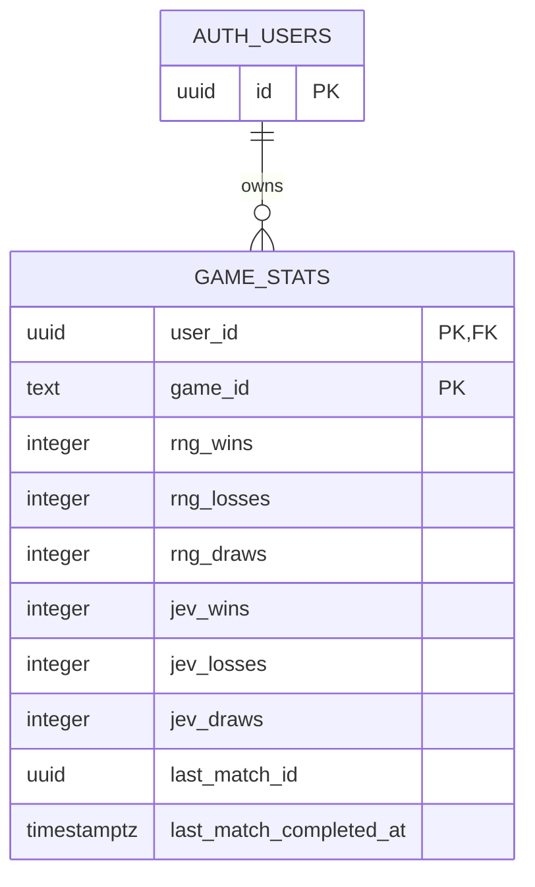

# v0.3 technical specification: Google sign-in and personal game statistics

Status: Draft for implementation review. Prepared: 2026-09-28.

## 1. Scope and source of truth

Implement optional Google sign-in through Supabase and personal win/loss/draw totals for Tic Tac Toe and Connect Four. The [product specification](product-spec.md) defines user-facing behavior. The SQL schema and database function are defined by [`20260928000200_game_stats.sql`](../supabase/migrations/20260928000200_game_stats.sql); this document describes how the browser app uses them.

Guests can continue to play RNG matches. Existing matches, move histories, and settings remain in browser storage. No match history or moves are stored in Supabase. Chess, Jev requests, Jev access limits and whitelist management, a Jev relay, public totals, and a leaderboard are outside this milestone. Jev statistics columns exist but remain zero until Jev play is introduced.

## 2. Existing application boundary

The application is a React/TypeScript Vite single-page app. `src/main.tsx` creates both game controllers and the application host. Each controller commits local match state and the shared shell in `src/components/AppShell.tsx` renders the navigation and settings. The new auth and statistics services must not replace the game rules, local match persistence, or settings store.

Use one browser Supabase client. The project URL and **publishable** key come from Vite environment configuration. Never place a Supabase secret/service-role key or Google's OAuth client secret in browser code. Configure the Google provider secret in Supabase. Exact local and production return URLs are deployment configuration, not constants in this specification; each deployed origin and path used by the app must be registered in Supabase's redirect allow list, and Google's OAuth client must use the Supabase callback URL. A successful redirect must return the user to the playable app without losing its locally saved match.

## 3. Authentication behavior

1. Show an optional **Sign in with Google** action to guests and a **Sign out** action to signed-in users. Neither action gates RNG play.
2. On startup, resolve the Supabase session and subscribe to auth changes. Keep an explicit loading/unknown state until the initial session check completes; do not treat that state as signed out.
3. The Google action starts Supabase OAuth. On return, restore the session and load the signed-in user's statistics. On sign-out, immediately clear user identity and statistics from in-memory UI state; local matches and settings stay in place.
4. On an account change, discard the previous account's in-memory statistics before loading the new account's rows. Do not show another account's cached totals while the new request is pending.
5. A cancelled or failed sign-in leaves RNG play available. Auth errors may be reported in the sign-in control; they do not change match state.

## 4. What counts as a result

Record a result exactly when an applied game transition changes a match from `ongoing` to a terminal outcome. This includes a winning or drawing terminal move by either player and confirmed human resignation. A human win increments `win`, a CPU win or human resignation increments `loss`, and a draw increments `draw`. Restart, Rematch, historical review, restored terminal matches, stale CPU responses, and invalid commands do not create results.

Credit the account signed in **when the match ends**, even if the match started while signed out. A match completed while signed out is never counted later. The result belongs to the match's game and to the CPU opponent selected when that match began. A Jev-started match remains a Jev result even if a later CPU move uses RNG fallback. Do not infer the opponent from the final move's provenance. Current v0.3 matches all use RNG.

Use the existing match UUID as `p_match_id`; do not generate a new ID when recording the result. Capture the terminal match, result, opponent, and signed-in account at the completion transition. Dispatch at most one recording request for that completion in the running app. Do not record again when the completed match is restored after reload. Current matches have only the RNG opponent; a later Jev implementation must add a match-level opponent identity rather than derive it from move provenance. The database's last-match-ID and one-second checks add protection against close duplicate submissions; they are not a permanent ledger of all completed IDs.

Statistics writes are best effort and do not block the terminal match state, local save, review, or Rematch. On a network/transport failure, retry the same RPC once with the same arguments and authenticated account. Do not retry a database rejection from the first attempt. A lost response may mean the first attempt committed; if the retry reports `Result already recorded or submitted too soon`, read that user's game row and treat the result as recorded only when `last_match_id` equals the submitted match ID. If the retry or reconciliation cannot confirm the result, show a toast that the result could not be saved. A direct database rejection on the first attempt remains silent in the game UI. Log failures to the browser console, including the exact `Result already recorded or submitted too soon` message when returned. Do not optimistically increment displayed totals; refresh them only from a successful RPC return or confirmed database read.

## 5. Database model and access

The schema has one `game_stats` row per `(user_id, game_id)`. The result counts are nonnegative integers from the human player's perspective. `last_match_id` is the last accepted client match UUID, and `last_match_completed_at` is the database time when that result was accepted, not a client-supplied clock value. A user with no row for a game has six zero totals for that game.

`auth.users` is managed by Supabase Auth. `game_stats` permits signed-in users to select only their own rows via Row Level Security. Browser roles have no direct insert, update, or delete rights. The `record_game_result` function obtains the caller's user ID from Supabase Auth, validates inputs, and performs the atomic increment under its defined privileges. The published SQL file is the schema source of truth; do not reproduce its DDL independently in application code.

The database accepts a new result only when its match ID differs from the most recently accepted match ID for that user/game and its server-recorded time is at least one second after the last accepted result for that user/game. A rejected request leaves all columns unchanged. The one-second rule applies separately to each game row. A previously accepted ID can be resubmitted after a different ID has been accepted; this limited duplicate protection is accepted for personal statistics. These totals are not verified competitive scores because an authenticated browser can call the RPC with a fabricated result.

## 6. Client-to-database contract

| Operation | Request | Success | Failure / absence |
| --- | --- | --- | --- |
| Load statistics | Select `game_stats` rows for the current authenticated user. | Up to two rows, one per supported game; map absent rows to zero totals. | Do not display stale totals from a previous account. Log fetch errors; keep gameplay usable. |
| Record result | Call Supabase RPC `record_game_result` with `p_game_id`, `p_opponent`, `p_result`, `p_match_id`. | Returns the updated `game_stats` row; replace that game's displayed totals with it. | Preserve the local completed match and current displayed totals. On transport failure, retry once and reconcile an apparent duplicate by reading `last_match_id`. Toast only if the retried result remains unconfirmed. A direct database rejection is console-only. |

Allowed RPC values:

| Argument | Type | Values / source |
| --- | --- | --- |
| `p_game_id` | text | `tic-tac-toe` or `connect-four`, from the terminal match |
| `p_opponent` | text | `rng` or `jev`, captured at match start; `rng` only in this milestone |
| `p_result` | text | `win`, `loss`, or `draw`, from the human perspective |
| `p_match_id` | UUID | The existing match ID, created when the match starts |

The client uses the Supabase JavaScript SDK with the authenticated session. It does not pass `user_id` or a completion timestamp to the function. No custom HTTP server is required for this milestone.

## 7. Integration and verification

Keep auth/session state separate from game-controller snapshots. Add a single completion observer or controller effect at the point where each game's accepted transition first becomes terminal; do not infer completion from a React render or from a snapshot subscription alone. Existing local writes must still happen before any remote statistics request. The statistics reader subscribes to auth state and must cancel or ignore stale loads after account changes.

Implementation acceptance checks:

1. Guests can start and complete RNG matches without signing in.
2. Google sign-in and sign-out change account UI without resetting either locally saved match or the shared settings.
3. A signed-in terminal move or confirmed resignation records exactly one correctly attributed result. A guest completion does not record a result, even after later sign-in.
4. A match started as a guest and completed after sign-in records for the account signed in at completion.
5. Restoring, reviewing, and rematching a completed game do not submit its result again. Switching accounts clears previously displayed totals before loading the next account's rows.
6. The database rejects an immediate repeat of a match ID and a different match submitted within one second for the same user/game. The game UI remains unchanged and the browser console receives the error.
7. A user cannot select another user's statistics or directly insert/update/delete statistics through the browser role. Concurrent accepted increments do not lose a count.
8. A transport failure retries exactly once with the same match ID and account. If the first write committed but its response was lost, the retry's duplicate rejection is reconciled against `last_match_id` without counting twice. An unconfirmed retried write shows a toast; a direct database rejection does not. No failure produces an optimistic total change.

## 8. Remaining implementation choices

The exact placement and visual treatment of sign-in, sign-out, statistics, and the failed-result toast within the shared shell can follow the existing design system. Environment-specific OAuth URLs and Supabase project values must be supplied when each environment is configured. These are configuration values, so their literal addresses need not appear in this document. The product specification remains unchanged; this document and the SQL migration describe the two last-match metadata fields.
