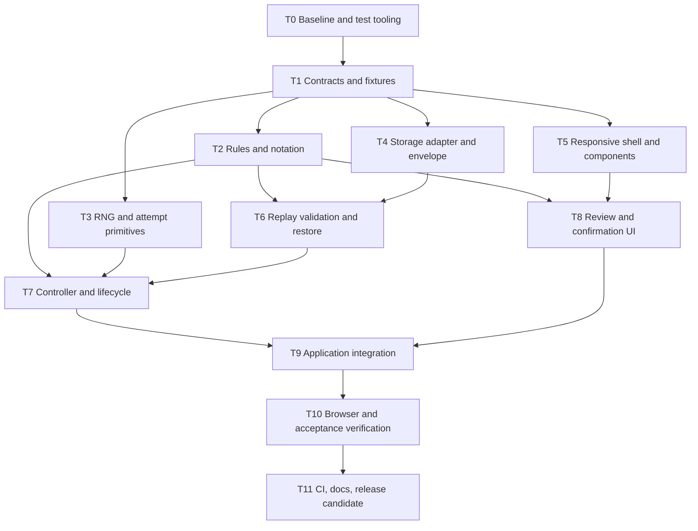

# v0.5 implementation plan

Status: Ready to guide implementation; storage-resilience behavior remains a proposed product default as noted below.

Prepared: 2026-09-23. This is an engineering plan, not a claim that implementation or verification has been completed.

## 1. Objective and scope

Deliver a complete, browser-only tic tac toe game against a random legal-move CPU, with the shared application foundation required by [product-spec.md](product-spec.md) and [tic-tac-toe-spec.md](tic-tac-toe-spec.md). Those specifications remain authoritative. References below use **P** for product-spec sections and **T** for tic-tac-toe-spec sections; for example, T9.4 means acceptance criterion 4 in section 9.

The milestone includes setup, legal play, wins/draws/resignation, optional move confirmation, asynchronous CPU coordination, retries and invalid-response fallback, historical review, responsive presentation, and local persistence. Show Tic Tac Toe, Connect Four, and Chess tabs; only Tic Tac Toe is enabled.

Do not implement Jev requests or scoring, authentication, statistics, a backend, other games, difficulty selection, undo, match archives, or cross-browser-tab synchronization. The shared request machinery is in scope even though the RNG provider normally succeeds immediately. Future Jev score semantics, credentials, global spending enforcement, network timeouts, and service-failure fallback remain in [jev-spec.md](jev-spec.md). They do not block v0.5.

## 2. Repository baseline and prerequisites

Observed in the current checkout:

- React 19.3, TypeScript 7, Vite 8.3, and Tailwind 4.3 are declared; TypeScript strict checking is enabled. Preserve the existing stack and lockfile rather than initiating a framework migration.
- `src/App.tsx` is a themed placeholder. No game, persistence, request coordinator, or test suite is present.
- `src/main.tsx` already enables React Strict Mode.
- `src/app.css` imports `vendor/design/sxc1-design-tokens.css`. That file is absent locally; the design directory is a declared Git submodule. Initialize the pinned submodule before validating the baseline. Do not replace its tokens or advance its pinned revision merely to begin this work.
- `vite.config.ts` already sets `base: '/pvjev/'`. `.github/workflows/deploy.yml` installs with `npm ci`, builds on pull requests, and deploys main to GitHub Pages using Node 24 and recursive submodule checkout.
- `README.md` is empty and the HTML title is still the template title.
- A submodule-status check in this execution environment failed because Git's shell helpers were unavailable. Verify a functioning Git installation/PATH when initializing the submodule; this is a local tooling prerequisite, not an application design issue.

Use Node 24 for development and CI to match the existing workflow. Establish a successful `npm ci` and `npm run build` before feature changes. This planning task does not certify that baseline. New development-tool versions must be resolved against the existing Node/Vite/React/TypeScript versions, installed together, and committed in `package-lock.json`; do not assume compatibility from a package's name alone.

## 3. Engineering decisions

### D1. Separate deterministic rules, application coordination, and rendering

Implement tic tac toe directly as pure TypeScript functions. Nine cells and eight winning lines do not warrant a rules dependency. Keep React, storage, clocks, random sampling, and promises out of the rules module.

Use a small application controller with immutable snapshots and a pure transition function. The controller owns ordered writes, CPU attempts, and subscriptions; React components send commands and render selectors. Create one controller at application bootstrap, outside React rendering, and pass it through context. Subscribe with `useSyncExternalStore`; keep snapshot identity stable until state changes and use a stable subscribe function. React documents those requirements for external stores. [React subscription reference](https://react.dev/reference/react/useSyncExternalStore)

This choice adds a little explicit coordination code but makes persistence-before-request ordering and race tests independent of React rendering. A component-only reducer/effect approach is viable, but would spread those operations across lifecycle effects. Do not add Redux, Zustand, XState, React Query, or a router for v0.5.

The controller lives above game views. Unsubscribing a board or switching the selected game must not cancel its match request. Implement a registry with tic tac toe's adapter and metadata for the two disabled games; do not invent implementations for them. Prove view independence in controller/subscription tests, since real inter-game switching is not available in v0.5.

### D2. Use explicit domain types and one authoritative history

Define the following contracts in the first implementation slice. `GameId` and `RequestState` are shared contracts; the `TicTacToe`-prefixed types describe this milestone's game-specific domain and view state, not requirements for future games:

| Type | Required contents and invariants |
| --- | --- |
| `GameId` | `tic-tac-toe`, `connect-four`, `chess`; only the first has a playable adapter. |
| `TicTacToeMove` | An integer cell index 0 through 8. Render indices row-major from top left: 0=A3, 1=B3, 2=C3, 6=A1, 8=C1. Validate integers and bounds at runtime. |
| `TicTacToePosition` | Readonly nine-cell board, next symbol, board-derived outcome, and all winning lines. X opens; terminal positions expose no legal moves. |
| `TicTacToeMoveRecord` | One-based `ply`, symbol, cell (`TicTacToeMove`), actor (`human` or `cpu`), and provenance (`human`, `rng`, or `rng-fallback`). Fallback records include a diagnostic reason; ordinary RNG records have no analysis. |
| `TicTacToeMatch` | Schema-independent domain object: game ID fixed to `tic-tac-toe`, unique match ID, chosen human symbol (X or O), ordered `TicTacToeMoveRecord` entries, live `TicTacToePosition`, and `TicTacToeOutcome`. Resignation records the human as resigning side and the ply at which it occurred. |
| `TicTacToeOutcome` | Discriminated union: ongoing, board win with winning symbol/lines, draw, or resignation with resigning/winning symbols. Do not represent resignation by placing a move. |
| `TicTacToeViewState` | Live or review with a selected one-based ply; optional pending human cell (`TicTacToeMove`); mobile-panel visibility and resignation-dialog state. Separate from durable match data. |
| `RequestState` | Idle, pending, or failed; current request token, start time, retry availability, error, and consecutive-invalid count. Controllers/timers are runtime resources, not serializable state. |

Expose a minimal generic rules adapter (`initialPosition`, `legalMoves`, `applyMove`, `reconstructPosition`) and a generic CPU provider over position/move types. Shared contracts must parameterize game-specific position, move, and side types where needed rather than depend on the concrete tic-tac-toe types above. Keep tic-tac-toe-specific coordinates, winning lines, history labels, and cell inspection in its adapter/selectors. Future games may supply different view models; do not require chess to use a nine-cell board or tic-tac-toe notation.

The ordered moves are authoritative. Replay them to reconstruct positions; at most nine moves makes snapshot-per-turn persistence unnecessary. Keep a derived live position in memory and serialize it to satisfy the live-state requirement, but verify it against replay when restoring. A mismatched stored snapshot is invalid, not a competing source of truth.

Use a generic optional analysis type on provider results and move records as an extension point. The production v0.5 provider uses no analysis payload; the v0.5 storage decoder accepts only v0.5 provenance and absent analysis. Define Jev's actual schema and a storage-version change with that integration, rather than assigning arbitrary score meaning now.

### D3. Define lifecycle and interaction transitions precisely

| Event/state | Engineering behavior |
| --- | --- |
| No current match | Show side selection with X selected initially and a Start game button; do not issue CPU work before Start. |
| Start as X / O | Create and save a fresh match ID. X always opens; as O, immediately schedule the CPU opening after the save attempt. |
| Restart before any committed move | Retain the chosen side, clear review/preview/dialog/request state, replace the match ID, save the empty match, and request an opening if CPU is X. No confirmation. In initial setup, Restart simply resets setup to X. |
| Active match with at least one move | Action is Resign, including during CPU thinking and historical review. Open confirmation; cancel leaves the match unchanged. Confirmation rechecks that the live match is still active, then ends it and invalidates CPU work. |
| CPU completes while resignation dialog is open | Apply the valid response normally. If it ends the match, close the obsolete dialog; its later confirmation cannot change the outcome. |
| Completed match | Action is Rematch without confirmation. Remove/replace only this game's match, clear transient state, and return to side selection. Retain the previous side as the initial choice, but require Start. |
| Legal empty-cell activation in live human turn | Commit immediately if confirmation is off; otherwise update pending preview without changing the match. |
| Confirm move | Recheck match ID, human turn, live view, nonterminal state, and cell legality; commit once. Repeated clicks cannot append duplicate moves. |
| Occupied-cell or history activation | Enter review of that symbol's original placement; clear pending preview. It is inspection even when selecting the latest move. |
| Empty-cell activation during CPU turn, review, or completion | No move or preview. Occupied cells remain available for inspection. |
| Toggle confirmation while a preview exists | Clear the preview without submitting it; save the setting separately. |

Pending preview and review selection reset on page reload; reload opens the live position. These are engineering defaults for otherwise unspecified transient UI details. Settings and committed match data persist.

### D4. Specify the asynchronous provider and stale-response protocol

Provider contract: `chooseMove({ position, legalMoves, signal }): Promise<{ move, analysis? }>`. Pass immutable copies/read-only data from the intended position. The coordinator attaches its own token to the promise closure; do not trust a provider to report the correct identifiers.

The RNG provider samples `legalMoves[Math.floor(random() * legalMoves.length)]` with an injectable random source, defaulting to `Math.random`. Reject an empty choice list as a programming error; never invoke it on a terminal match. No worker or network client is necessary. Resolve asynchronously, without imposing an artificial thinking delay. The thinking state exists while the promise is pending, even if it is too brief to notice for ordinary RNG play; delayed test providers cover its visible behavior.

Each token contains `{ gameId, matchId, expectedPly, attemptId }`. Here `expectedPly` is the next individual move number (`history.length + 1`), distinct from the displayed X/O pair number. Use fresh UUIDs for matches and attempts via an injected ID factory. The token identifies an immutable position because matches only append moves and replacements always receive a new ID.

On every success, failure, and timer callback, check that the token remains current, the match exists and is active, its next ply matches, and it is still the CPU's turn. Stale events are ignored before checking response legality, changing errors, or counting invalid attempts.

Commit sequence:

1. Validate the command against the current state and apply the pure transition.
2. Attempt synchronous persistence of the resulting durable match, including outcome if terminal. A failed write follows D5 and does not roll back a legal move.
3. Publish the immutable snapshot and clear obsolete preview/request resources.
4. If the new live state requires CPU play and no current attempt exists, register a new token, publish thinking state, and invoke the provider. Catch synchronous provider throws as well as rejected promises.
5. A successful provider result must pass runtime shape checks and the same rules legality check used for humans before it follows the commit sequence.

Register the attempt before invocation to handle immediately resolved promises. The request's legal-move list is advisory input; the rules are authoritative when the result arrives. Reconcile terminal state even for a completed match with a pending stale response.

| Request event | Required policy |
| --- | --- |
| Still pending after 5,000 ms | Reveal Retry. Do not abort, automatically retry, time out, or apply RNG fallback. Measure from this attempt's start, and ignore stale timer events. |
| Manual Retry | Immediately replace the token, cancel its timer, and best-effort abort the old attempt; start a new attempt with a new five-second threshold. Preserve the invalid count. |
| Explicit throw/rejection | Set a visible failure state and immediately enable Retry. Preserve the invalid count; no automatic service-failure fallback. |
| Current response has missing/malformed/illegal move | Count one invalid attempt. Automatically request another move after invalid attempts one and two. |
| Third consecutive invalid response | Surface a diagnostic, select directly from freshly computed legal moves with the trusted RNG sampler, and commit `rng-fallback` without analysis. Do not recursively call the failing provider. |
| Valid CPU move, including fallback | Reset invalid count and release the request/timer resources. Keep a fallback diagnostic with the move. |
| Restart, Rematch, resignation, or disposal | Invalidate first; then cancel timers and best-effort abort. Late promises cannot mutate state. |

Use a neutral v0.5 fallback message, such as “CPU returned three invalid moves; a random legal move was used.” Reserve the exact Jev message from P5.3.5 for the future Jev provider; do not incorrectly attribute RNG/test failures to Jev.

`AbortController` provides cancellation signaling, but the token checks remain the correctness mechanism even for a provider that ignores its signal. [AbortController reference](https://developer.mozilla.org/en-US/docs/Web/API/AbortController/abort)

Start the app controller once at bootstrap; make `start()` idempotent and `dispose()` release requests and timers. Dispose on development hot-module replacement and in tests. React component effects only subscribe/unsubscribe and manage local presentation, not provider dispatch. Preserve Strict Mode and test remounting: React deliberately repeats development effect setup/cleanup. [React Strict Mode reference](https://react.dev/reference/react/StrictMode)

### D5. Version, namespace, and validate local persistence

Use a small storage adapter with injected `getItem`, `setItem`, and `removeItem` behavior for tests. Use JSON envelopes containing `schemaVersion: 1` under keys:

- `pvjev:v0.5:match:tic-tac-toe` for the one current match.
- `pvjev:v0.5:settings` for `{ confirmMoves: boolean }`, default false.

These names avoid collisions with other projects sharing the GitHub Pages origin. Local storage is scoped to origin and can persist between browser sessions; access itself can throw when browser policy blocks storage. Catch acquisition, reads, writes, and removal, not just JSON parsing. [MDN localStorage](https://developer.mozilla.org/en-US/docs/Web/API/Window/localStorage)

Write on Start, every committed move, resignation, Restart, and Rematch replacement/removal. Also save invalid-count recovery metadata after the first and second invalid responses, before dispatching the next attempt; the third response proceeds directly to the persisted fallback move with the count reset. Write settings when changed. Do not depend on unload, debounce match writes, or write previews and navigation. Serialize one complete match in one key; never split board and history across writes. Retain a completed match until Rematch, with no archive. There is no multi-key transaction requirement between independent settings and match data.

On restore, treat JSON as `unknown`. Validate version, game ID, identifiers, side, array lengths, move shapes, provenance, and ply sequence. Replay from the empty board, rejecting duplicate cells, wrong alternation/actor, moves after terminal positions, impossible outcomes, and live-state mismatch. Validate resignation against an otherwise ongoing position and its recorded ply. Persist the current CPU turn's invalid count (0–2 between retries) as recovery metadata and validate it, so reload does not silently reset the invalid-response sequence. Do not persist request tokens, timers, pending promises, or errors for superseded attempts.

Load settings independently so invalid match data cannot discard a valid preference. Once a valid match is loaded, display live state; if it is the CPU turn, issue one fresh attempt with new runtime identifiers. Never reapply the last saved human move. A restored terminal match issues no requests.

**Proposed resilience default, pending product confirmation (P7.6/P11.3):** on unavailable/full storage, keep playing in memory and display a persistent notice that progress/settings cannot be saved. Storage quotas can cause writes to fail, so this path must be exercised. [MDN storage quotas](https://developer.mozilla.org/en-US/docs/Web/API/Storage_API/Storage_quotas_and_eviction_criteria)

For invalid or unsupported saved data, offer Start fresh; do not silently overwrite it during bootstrap. Start fresh replaces only the affected app key after the user chooses that recovery action. Invalid settings use false in memory with a notice and are replaced on an explicit setting change. A failed removal/replacement leaves the in-memory app usable but the notice must explain that a reload may restore older data. No migration is needed before the first format exists; unknown future versions follow the incompatible-data path.

Engineering work can implement and test these recovery branches now. Record confirmation or a replacement policy in the product spec before declaring this portion of acceptance complete; this plan does not assert that the proposal was already agreed.

### D6. Derive historical presentation independently from live state

Use `view = { mode: 'live' } | { mode: 'review', ply }`; do not encode live as “last history index.” This preserves read-only behavior when the selected history entry happens to be the latest move.

- Reconstruct the board after the selected move. Never render later symbols or expose the initial empty board as a navigation destination.
- Label ply `n` as `ceil(n / 2)` plus lowercase symbol, followed by coordinates: `1x A1`, `1o C3`.
- Left from live selects the latest committed move for inspection; further Left goes back one ply. In review, Right advances one ply. Disable controls at the first/last historical positions; Right at the latest move remains review. Only Return to current exits review.
- With no committed moves, show an empty-history message and disable navigation. Occupied-cell inspection resolves the move by that cell; a symbol never moves in this game.
- Human inspection shows the historical board and highlight only. CPU RNG inspection says “Random CPU move”; fallback inspection says “Random fallback” with its retained diagnostic. Render no score table or fabricated analysis.
- A CPU completion during review updates live match/status/history and persistence but preserves the selected ply. The new entry can become reachable by Right. Return to current reveals the newest position.
- The top status always describes the live match, including its result; show a separate “Reviewing …” indicator so a historical board is not mistaken for live play. A failed request uses an error/retry status rather than claiming an inactive request is still thinking.
- Compute winning backgrounds from the displayed historical position; earlier positions never inherit the live winner's backgrounds. Resignation adds no winning line. Terminal top status does not change the selected historical board.

### D7. Keep the visual implementation responsive and usable

Reuse existing design tokens and dark theme. Replace the placeholder screen and template title with Play vs Jev. Use text/CSS for X/O and winning cells; no generated images are needed.

Choose a 900 CSS-pixel layout breakpoint: board plus history/inspection side panel above it; board followed by collapsible history/inspection below it. Keep controls touch-sized (at least 44 CSS pixels), board width bounded by available space, and history independently scrollable on desktop. Mobile history opens automatically for an inspection selection and can be collapsed without returning to live. Verify the breakpoint with content rather than assuming it is correct on every device.

Live latest move uses a blue inset outline; reviewed move uses a yellow inset outline. Winning cells use green/red backgrounds relative to the human side; outlines remain visible over those fills. Mark the union of every winning line from the last move. Preview uses a 1.8-second opacity animation and a visible Confirm move button. Under reduced-motion preference, use a static translucent preview with a pending label; CSS supports detecting that preference. [MDN reduced motion](https://developer.mozilla.org/en-US/docs/Web/CSS/Reference/At-rules/@media/prefers-reduced-motion)

Use native buttons, checkbox, and a native dialog for resignation, including cancel, Escape, and focus return. Label cells with coordinates, contents, and inspection purpose; announce turn/result/errors politely and provide textual results so color is not the sole signal. Preserve standard Tab/Enter/Space behavior without adding custom arrow-key board gameplay. Use ordinary navigation buttons styled as game tabs, with native `disabled` on future games; avoid ARIA tab semantics that would imply an unimplemented tab-keyboard interaction pattern.

### D8. Verify behavior with deterministic tools

Add Vitest for pure rules, storage, and controller tests; use fake timers and controllable promises for race/retry tests. Its Vite integration and timer controls fit the existing stack. Verify the installed tool versions in T0 rather than pinning an untested version in this document. [Vitest setup](https://vitest.dev/guide/), [fake timers](https://vitest.dev/guide/mocking/timers)

Add Playwright for browser integration and responsive checks. Run against the production build served by Vite preview at `/pvjev/`, using Playwright's managed web server. [Playwright web server](https://playwright.dev/docs/test-webserver)

Use injected seeded RNG, IDs, storage, clock, and deferred/scripted providers in unit/controller tests. Browser tests should use legal deterministic saved fixtures where useful, then assert CPU legality rather than a specific random choice. Do not add a public query parameter for forcing provider failures or a test provider to the production UI. Mount/unmount React against a controller in a separate test harness if needed to exercise subscription lifetime.

Playwright mobile profiles cover viewport/touch emulation, not certification on physical phones. Automate desktop Chromium/Firefox/WebKit and representative iPhone/WebKit and Android/Chromium layouts, then record a brief real-device smoke check when available. [Playwright emulation](https://playwright.dev/docs/emulation)

## 4. Suggested module boundaries

```text
src/
  app/
    contracts.ts          # shared provider/adapter/envelope contracts
    controller.ts         # ordered commands, persistence, request reconciliation
    transitions.ts        # pure application state transitions
    selectors.ts          # live/review/status/action view models
    registry.ts           # implemented adapter + disabled-game metadata
    AppProvider.tsx       # context and useSyncExternalStore binding
  cpu/
    random.ts             # legal sampler and async RNG provider
    requests.ts           # attempt tokens, timers, cancellation helpers
  storage/
    localStorage.ts       # exception-safe storage boundary
    codecs.ts             # version and shape checks; replay validation
  games/tic-tac-toe/
    rules.ts              # symbols, board, legality, outcome, reconstruction
    notation.ts           # cell coordinates and per-ply labels
    Board.tsx             # presentation and event forwarding
  components/
    GameNavigation.tsx
    MatchSetup.tsx
    MatchControls.tsx
    MoveHistory.tsx
    MoveInspection.tsx
    Status.tsx
  App.tsx
  app.css
  main.tsx
tests/
  fixtures/               # valid/invalid saves, scripted providers
  e2e/
```

Colocate unit tests with modules or use matching folders under `tests`; choose one convention in T0. This layout specifies ownership boundaries, not a requirement to create empty files or layers. Keep shared contracts minimal and combine small presentation files if that improves readability.

## 5. Work packages and dependency DAG

Each package includes its focused tests and a reviewable change. A dependency means the upstream contract/behavior is available and verified; it is not permission to postpone testing until the end. The table's prerequisite list is authoritative.



| ID | Prerequisites | Engineering actions / deliverable | Completion evidence |
| --- | --- | --- | --- |
| T0 | None | Restore pinned design dependency; establish Node 24 install/build; add compatible Vitest/Playwright tooling and scripts (`test`, `test:watch`, `test:e2e`); configure production-preview base URL, isolated browser storage, and artifacts on failure. | Clean install and build pass; a minimal test smoke run proves each runner works. No unrelated dependency upgrades. |
| T1 | T0 | Define D1–D4 contracts, command/result unions, storage envelope, injectable dependencies, and component props. Add valid ongoing/terminal saves and scripted provider fixtures. Document transient defaults and proposed recovery policy. | Types compile; fixtures have expected states independent of implementation; downstream work can use agreed interfaces without editing one another's files. |
| T2 | T1 | Implement initial state, eight win lines, legal moves, move application, reconstruction, coordinate mapping, and notation. Reject all post-terminal moves. Keep resignation in match lifecycle rather than board rules. | U1–U3 below pass, including double-line wins, ninth-cell win precedence, and exhaustive reachable-state invariants. |
| T3 | T1 | Implement pure legal sampler, async RNG provider, request token helpers, injectable timer/ID infrastructure, and cancellation cleanup. Create deferred/failing/illegal providers only in tests. | U4 sampler tests and primitive token/timer tests pass; no React/storage coupling. Full retry policy is tested in T7. |
| T4 | T1 | Implement namespaced JSON reads/writes/removals, version envelopes, independent settings, and typed success/unavailable/invalid results. Recovery presentation is supplied through props. | U5 shape/version/exception cases pass using fake storage. Rule-dependent replay checks remain in T6. |
| T5 | T1 | Build responsive shell, disabled navigation, setup, status/error/retry, match action, confirmation setting, resignation dialog, history/inspection containers, and semantic board cells against fixture props. Reuse tokens. | Components compile; fixture views cover desktop/mobile, long errors, focus, and disabled tabs. No live CPU orchestration is embedded in components. |
| T6 | T2, T4 | Complete semantic save decoding by replay; compare stored live state/outcome; restore settings and CPU invalid count; implement invalid-save recovery state. | U5 semantic corruption cases pass; valid human-turn, CPU-turn, won/drawn/resigned saves round-trip without losing history. |
| T7 | T2, T3, T6 | Implement controller/bootstrap, pure transitions, save-before-request, retry threshold, stale suppression, automatic illegal retries/fallback, lifecycle actions, restore recovery, and snapshot subscriptions. | U6–U9 pass with fake time/promises; headless complete matches work and survive reload serialization. No lost/duplicate moves under adversarial response ordering. |
| T8 | T2, T5 | Implement board/history selectors, per-ply inspection/navigation, preview/confirmation events, highlights, overlapping winning fills, live status during review, and mobile expansion. Work against the T1 command/snapshot contract. | Fixture-driven UI demonstrates every view state; U3 selector/notation tests pass. Controls never locally mutate durable match state. |
| T9 | T7, T8 | Wire controller to React at bootstrap; replace placeholder App/title; connect controls and recovery notices; verify Start-to-terminal-to-Rematch flows; dispose correctly on HMR. | Playable X/O matches, persistence, review during CPU response, and Strict Mode remount checks pass before the full browser matrix. |
| T10 | T9 | Run B1–B7 and the traceability checklist; inspect 1080p/1440p and narrow mobile layouts; fix failures at their owning layers. Resolve/document the proposed storage policy for final acceptance. | All v0.5 acceptance rows have passing evidence; real-device checks are recorded or explicitly outstanding. No known state-loss or stale-response defect remains. |
| T11 | T10 | Gate the existing Pages build/deploy on tests; add README setup/testing/behavior/limitations; document Node/submodule prerequisites and test results; prepare version 0.5.0 with lockfile consistency. | CI passes install, unit tests, typecheck/build, and browser tests; production preview loads `/pvjev/`. Release candidate is ready for normal main/Pages release flow. |

### Execution order and parallel work

1. Finish T0 and T1 first. Contracts, event names, fixture shapes, and test conventions are the synchronization point.
2. T2, T3, T4, and T5 can proceed independently. Their owned paths are rules/notation, CPU primitives, storage adapter, and presentation respectively. A single implementer can use that order; multiple implementers can work in parallel without a shared `App.tsx` rewrite.
3. T6 starts when rules and storage are ready. T8 starts when rules and the shell are ready. T3 can still be finishing while either proceeds.
4. T7 begins after T2/T3/T6; it can run alongside T8. Keep one owner for controller wiring and one for presentation. Agree contract changes before applying them across branches.
5. T9 joins the application and UI branches. T10 then validates the integrated behavior; T11 closes the release candidate. Test/CI configuration and README drafts can be prepared earlier, but their final acceptance depends on T10.

The principal dependency chain is `T0 → T1 → T2/T4 → T6 → T7 → T9 → T10 → T11`, with `T3 → T7` and `T5/T2 → T8 → T9` as additional gates. This describes dependencies, not a duration-based critical-path estimate. Do not serialize independent modules merely because their IDs are ordered; do not integrate against unfinished contracts to claim parallel progress.

## 6. Verification cases

### Unit and controller suites

| Suite | Required cases |
| --- | --- |
| U1: Rules | All three rows, three columns, and two diagonals for both symbols; empty/occupied/out-of-range/noninteger moves; alternation; draw; win before draw on ninth placement; one move forming two winning lines; no further moves after board completion. |
| U2: Reachable-state invariants | Traverse the finite legal game tree from the empty board, stopping at terminal states. Assert move count increases by one, only one cell changes, symbols/counts remain consistent, legal cells are exactly the empty cells for ongoing positions, and terminal positions have no legal continuations. Use independent explicit expected-line fixtures from U1 so the traversal does not merely restate the implementation. |
| U3: History/selectors | Every coordinate and label; replay every prefix; no initial-position destination; live vs review-of-latest distinction; occupied-cell mapping; yellow/blue overlap with win fills; earlier boards lack later symbols/wins; human/RNG inspection has no scores. |
| U4: RNG | Every legal choice is reachable through controlled random inputs; boundary values 0 and just below 1; singleton set; empty-set protection; input remains unchanged; never produces an occupied/out-of-range cell. Avoid flaky statistical fairness assertions. |
| U5: Persistence | Match/settings round trips; independent preference retention; malformed JSON, unsupported schema, wrong side/actor/ply, duplicate cells, continuation after a win, forged outcomes, snapshot mismatch, invalid resignation, invalid counter; blocked reads, quota writes, failed removal; no startup overwrite of bad saves. |
| U6: CPU scheduling | Human move is saved before invocation; terminal human move triggers no CPU; CPU opens for human O; restored CPU turn invokes once; stale success, rejection, timer, and invalid response are all ignored; repeated start/reconcile does not duplicate work. |
| U7: Retry/fallback | Retry hidden at 4,999 ms and available at 5,000 ms; threshold does not dispatch work; manual retry supersedes; explicit failure allows immediate retry; illegal/illegal/valid resets counter; illegal/illegal/illegal commits exactly one legal fallback; manual/service failures do not increment or clear invalid count; valid move resets; reload preserves partial invalid count. |
| U8: Lifecycle races | Restart during opening request; resign while request pending; canceled resignation; CPU terminal result while dialog open; Rematch then late old response; multiple immediate human/confirm clicks; subscription unmount/remount does not restart provider; dispose ignores all late callbacks and clears timers. |
| U9: Review and live separation | Preview creates no save/request/history entry; another preview replaces it; inspection clears it; confirmation toggle clears it; no play in review; CPU arrives during review and saves without moving selection; resignation preserves selected historical board; Return to current shows latest. |

### Browser and manual acceptance

| Suite | Required scenarios |
| --- | --- |
| B1: Full match | Start as each side; CPU always legal; win/loss/draw from valid fixtures; action labels and resignation confirmation/cancel; completed review; Rematch returns to setup. Assert ordinary RNG/fallback labels and absence of score tables. |
| B2: Confirmation and inspection | Default immediate submission; enable preference; change pending cell; confirm once; inspect from cells/history; browse moves and return to live; no play while reviewing, including review of latest. Check preference survives Rematch/reload. |
| B3: Recovery | Reload on human turn, CPU turn, and completed states; compare board/history/outcome; malformed-save fresh start; storage exceptions show notice and allow in-memory play. Inject storage faults before app startup in browser test setup. |
| B4: Responsive visuals | 1920×1080 and 2560×1440 desktop; 390×844 iPhone-style and 412×915 Android-style mobile; 320 CSS-pixel stress width. Check visible desktop board during review, collapsible mobile history, no horizontal overflow, touch targets, and overlapping highlights. |
| B5: Browser controls | Native focus, keyboard activation, dialog Escape/focus return, meaningful cell labels, status/error text, reduced-motion preview; enabled and disabled navigation cannot open unfinished games. |
| B6: Production runtime | Serve built output under `/pvjev/`; assets load without console exceptions; reload works at the application URL; no required backend/Jev calls or production mock-analysis controls. Test with clean storage and a valid saved match. |
| B7: Real devices | Brief Safari on a modern iPhone and Chrome on a modern Android: start, play, inspect, confirm, reload, expand/collapse history. Record device/browser versions and outcome; emulation alone is not this evidence. |

Race/error-policy coverage belongs primarily in the deterministic controller suite; browser coverage proves its normal wiring, persistence notices, and user interaction. Avoid repeating every race in every browser or relying on arbitrary sleeps. If physical devices are unavailable, report that limitation instead of claiming their validation passed.

## 7. Requirements-to-work traceability

| Requirement source | Engineering action / owner | Verification |
| --- | --- | --- |
| P2 v0.5, P3.1–4, P4.1.1, P9.1–2 | T5/T9: browser-only React shell, three visible tabs, one enabled game, no auth/backend. | B1, B5, B6 |
| P3.2–3/7, P4.1.3–4, P9.8, T8.5 | T5/T8: desktop side panel, mobile collapse, responsive/touch controls. | B4, B5, B7 |
| P4.1.2, P3.6, P8 | T1/T7: per-game controller ownership independent of selected view; no cross-browser-tab syncing. | U6, U8; actual multi-game switching deferred until a second game exists. |
| P4.2, P9.3–4, T3, T9.1–6 | T2/T7: side setup, X first, authoritative legality/outcomes, no post-terminal moves, no undo/timer/difficulty. | U1, U2, U6, B1 |
| P4.3, P9.5, T3.8–9, T9.13 | T7/T8: Restart/Resign/Rematch transitions, required resignation dialog, side setup after Rematch. | U8, B1 |
| P4.3 preference, T4.2, T9.7 | T4/T7/T8: separate persisted confirmation setting; pending preview, replacement, clear-on-review, validate-on-confirm. | U9, B2, B5 |
| P5.1, P9.6/9, T8.2/4, T9.12 | T7: ordered save/request, token validation, live/review separation, restore CPU request. | U6, U8, U9, B3 |
| P5.2, P9.9 | T3/T7/T9: five-second manual Retry and immediate explicit-error Retry, latest attempt wins. | U7, U8; error/retry presentation in T5 fixtures. |
| P5.3, P9.10, T8.1–2 | T2/T3/T7: runtime legality, three invalid responses, legal RNG fallback, diagnostic provenance. | U4, U7; exact Jev-attributed message deferred to Jev implementation. |
| P6.1–5, P9.7/12, T4.1, T5, T6.1–6/9–11, T9.3/8–10/12–13 | T2/T7/T8: complete history, post-move reconstruction, read-only review, notation, occupied-cell inspection, retained completed match. | U3, U9, B1, B2 |
| P6.8, T6.5–6, T9.10 | T1/T8: provenance labels; no analysis for human/RNG moves and no mock data in production. | U3, B1, B6 |
| P6.6–7, P9.11, T6.7–8, Jev part of T9.10 | T1: optional typed extension seam only. Evaluation, top-ten rankings, retained Jev response display/reopening are deferred provider features. | Scope review now; Jev-specific tests when integrated. |
| P7.1–5, P9.6/12, T8.3–4, T9.14 | T4/T6/T7: current-match envelope, live state/history/outcome, independent settings, restore and overwrite instead of archives. | U5, U6, B3 |
| P7.6/P11.3 proposed fallback | T4/T6/T9: exception-safe adapter, memory-only notice, explicit fresh-start recovery; confirm policy before acceptance. | U5, B3 |
| T7, T9.11, T2.4 | T8: live turn/result status, blue/yellow outlines, all green/red winning backgrounds, no image dependency. | U1, U3, B4, B5 |
| P3.5/P11.1, Jev spec | No Jev spending or credential implementation in v0.5. Do not represent local browser counters as a global cap. | Scope review; no Jev requests in B6. |
| P10, T10 | Keep accounts, archives, multiplayer, export, branching, independent tic-tac-toe first-player selection, and other excluded features out. | T10 acceptance review and README limitations. |

## 8. Release candidate gates and remaining decisions

The candidate is complete when T0–T11 evidence is recorded, every applicable P9/T9 acceptance criterion is covered by the matrix, and the production build runs at the repository base path. Add a small verification record to the implementation PR listing commands/results, tested browsers/devices, and remaining limitations.

Recommended CI order is recursive checkout → Node 24 → `npm ci` → `npm test` (non-watch Vitest) → `npm run build` (includes TypeScript checking) → install Playwright browsers/dependencies → `npm run test:e2e` → existing Pages artifact/deploy steps. Preserve the current PR/main deployment guards. Upload browser traces/screenshots on failure; do not deploy a build whose checks failed. Vite's deployment guidance requires the repository subpath base for project Pages sites. [Vite static deployment](https://vite.dev/guide/static-deploy.html)

No framework, rules-library, routing, backend, or Jev research decision blocks implementation. The storage-resilience policy is the only already-identified unconfirmed shared product behavior: this plan proposes a concrete default but preserves its status until reconciled with P7.6. Setup defaults, transient-state reset, navigation boundaries, and animation/layout values above are engineering choices and can be adjusted without changing the durable contracts.

Publishing is a release step after verification; writing or executing this plan does not itself require a deployment. Existing unresolved Connect Four/chess/Jev specs can continue independently while v0.5 is built.
